| No  | source   | model| Based on | Maker   | Google翻訳   | description|
|-----|------------------------------------------------------------------------------------------------------|--------------------------|--------------------------------------------------|-----------------|--------------------------------------------------------------------------------------------------------------------------------------------------------------------------------------------------------------------------------------------------------------------------------------------------------------------------------------------------------------------------------------------------------------------|------------------------------------------------------------------------------------------------------------------------------------------------------------------------------------------------------------------------------------------------------------------------------------------------------------------------------------------------------------------------------------------------------------------------------------------------------------------------------------------------------------------------------------------------------------------------------------------------------------------------------------------------------------------------------------------------------------------------------------|
| 1   | 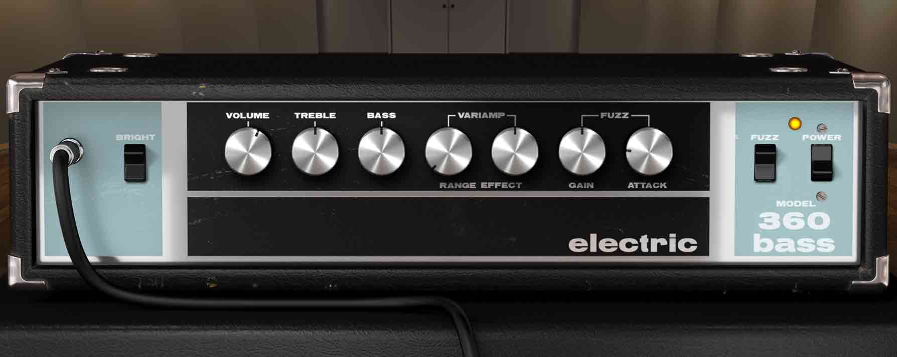   | 360Bass_Preamp   | Acoustic® 360™ Bass Preamp   | Acoustic| 12ワット、12インチシングルのオールチューブコンボ。フェンダーツイードアンプの中でも最も愛されているこのアンプは、きらめくクリーンから力強いクランチまで、あらゆるサウンドを網羅しています。ハンドワイヤードのオールチューブ5E3回路は、あらゆる音量レベルで魔法のようなサウンドを生み出します。Tweed Deluxeは、その圧倒的な存在感と倍音特性から、開発者のお気に入りのトーンでした。このカスタムツイードバージョンは、まるでおとぎ話のようです。外見は美しく、サウンドはまさにモンスターです。| This amp toured and recorded for years with one of the biggest and bold rock bands ever. Classic rock tones are a natural with this amp, but it is also known for being used by one of the most famous jazz bassists of all time. Show no quarter and make your bass kill with this amp - solid state but loud and proud.  |
| 2   | 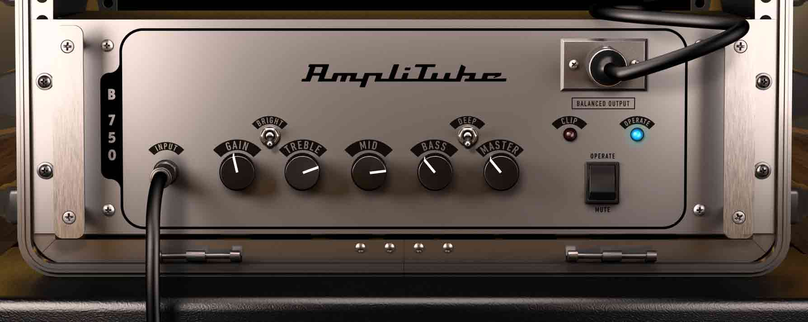 | New_York_B750| Aguilar DB750.   | Aguilar | 1972年、OrangeはOrangeサウンドを定義することになるアンプを発売しました。数年後、写真のみを使用し、テキストを一切使用しなかったことから「Pics Only（写真のみ）」というあだ名が付けられました。復刻版ではありませんが、OR50Hは、その外観、トーン、そして採用された構造技術に至るまで、このヴィンテージの伝説的なアンプに敬意を表して作られています。伝統的なシングルチャンネルに3段階のゲインセクションを備えたOR50の真の武器は、HF Driveコントロールです。これは2つのコントロールを1つにまとめたものです。コントロールを時計回りに回すと、パワーアンプの存在感が増し、パワーアンプのゲインに新たな次元が加わります。これは、これまでで最も汎用性の高いシングルチャンネルアンプの一つと言えるでしょう。  | This American bass amplifier model is the perfect combination of tubes and MOSFET technology with its all-tube preamp and discrete MOSFET output section. It takes any bass to its finest with its raw power and excellent tone, and with its wide frequency response, it's perfect to be paired with low-tuned or five or six-string basses.  |
| 3   |  | SVX-15N  | Ampeg® HERITAGE B-15N® Model | Ampeg   | Peavey® 5150 をベースにしたこの伝説的なアンプは、もともとエディ・ヴァン・ヘイレンのシグネチャーモデルでしたが、その象徴的なサウンドはすぐにジョー・サトリアーニ自身を含む多くのハードロックやヘビーメタルのアーティストの定番トーンとなりました。| The Heritage B-15N features distinct 1964 and 1966 channels, plus Ampeg's flexible Baxandall EQ and selectable bias modes for ultimate tone control. Built to exacting standards, it meticulously recreates the world's most recorded bass tone.   |
| 4   |  | SVX-15R  | Ampeg® B-15R® Portaflex “Flip Top” Model | Ampeg   | SLD 100は、ハイゲイン・チューブ・ディストーション・トーンの真のアイコンです。20年以上もの間、そのデザインは変わらず受け継がれ、品質とデザインの象徴となっています。世界最高峰のギターアンプと称されることも少なくありません。SLD 100は、プリアンプとマスターボリュームを独立してコントロールできるほか、3バンドのイコライザーとプレゼンス・コントロールも搭載しています。最高級のミリタリーグレードのコンポーネントとカスタム設計のトランスフォーマーを採用し、業界最高峰のハイゲイン・ギター・トーンをあなたの手にお届けします。  | This is the 1960’s classic bass amplifier, enhanced and improved for the actual musical scenario. This all-tube model limited production features the Ampeg “classic” tube preamp combined with a selectable tube 60W/100W power amplifier. This option gives you the most sought-after vintage bass sound ever. In addition, if you want to get that unmistakable '60s tone; match it with the B-15R cabinet. |
| 5   |    | SVX-4B   | Ampeg® V-4B® Model   | Ampeg   | このモデルは、ソリッドステートのベースプリアンプ、EQ、そしてソリッドステートのパワーアンプモジュールを搭載しています。美しいクリーンサウンドと力強いドライブサウンドを両立しています。   | The Ampeg V-4B is an all-tube 100W legend, reissue of the legendary 1971 original, delivering the pure tube vintage sound and unmistakable grind that earned this classic a place in bass history. |
| 6   |  | SVX-500  | Ampeg® BA500® Model  | Ampeg   | クラシックなフェンダー®トーンと現代的な汎用性を融合させたこのアンプは、ヴィンテージ・クリーントーンから70年代スタイルのクラシックロック・クランチ、そしてモダンなメタルやパンクまで、あらゆるサウンドに最適です。独立したカスケード・ゲインステージとカスタムEQにより、ギタリストはヴィンテージからモダンまで、幅広いバリエーションのハードエッジなディストーショントーンを自在に作り出すことができます。しかも、紛れもないフェンダー®のキャラクターはそのままに。   | The BA-500 is a high quality solid-state bass amp, with a sonic fingerprint that will deliver a big and detailed sound in any musical situation. Thanks to its powerful preamp sound shaping controls, this amp model will be great on all musical genres. Its natural cabinet match is the BA-500 cabinet, but you can get interesting sounds experimenting with all the included cabs options.   |
| 7   | 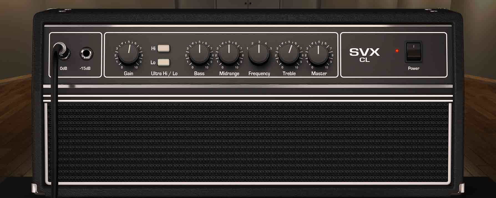   | SVX-CL   | Ampeg® SVT-CLASSIC® Model| Ampeg   | Heritage B-15Nは、1964年と1966年の2つのチャンネルを特徴とし、Ampeg独自の柔軟なBaxandall EQと選択可能なバイアスモードにより、究極のトーンコントロールを実現します。厳格な基準に基づいて製造され、世界で最も多く録音されたベーストーンを細部まで忠実に再現します。   | This is the authentic and classic Ampeg tube sound. This all-tube bass head delivers a warm, harmonically rich and punchy sound that is a trademark for the rock bass sound, both live and in the studio. The SVT-Classic is the amp that created the rock bass sound. Its natural speaker match is the SVT-810E or the SVT-410H.  |
| 8   |  | SVX-PRO  | Ampeg® SVT-4PRO® Model   | Ampeg   | 1960年代のクラシックなベースアンプを、実際の音楽シーンに合わせて強化・改良したモデルです。この限定生産のオールチューブモデルは、Ampegの「クラシック」チューブプリアンプと、60W/100Wの切り替え式チューブパワーアンプを搭載しています。このオプションにより、最も人気の高いヴィンテージベースサウンドが得られます。さらに、紛れもない60年代のトーンを求めるなら、B-15Rキャビネットとの組み合わせがおすすめです。| This is a real all-round high end bass amplifier. It combines a fully featured tube preamp that can really cover any sound need with a tight solid state power amplifier. The SVT-4PRO sound spectrum is wide and rich. You can get from extremely neutral and transparent sounds to powerful unique tones. Experiment with the SVT-4PRO settings and create your own custom sounds.   |
| 9   | 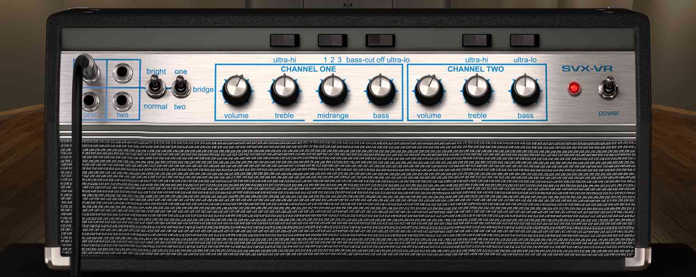   | SVX-VR   | Ampeg® SVT-VR® Model | Ampeg   | Ampeg V-4B は、オールチューブ 100W の伝説的モデルで、伝説的な 1971 年オリジナルの復刻版です。純粋なチューブ ビンテージ サウンドと、このクラシックにベースの歴史に名を残した紛れもないグラインドを実現します。| The Ampeg SVT-VR is a vintage reissue of an early 1970s “Blue-Line” SVT head. The preamp stage, power section, and even rocker switches emulate the exact signal path, tone, and vibe of the original rock ’n’ roll workhorse. This is the exact recreation of the '70s best rock bass amp ever.   |
| 10  |  | Bassman_300  | Bassman® 300 PRO Model   | Bassman | ジョン・ディーコンがゴミ捨て場で見つけた古いラジオを改造して作ったこの小型アンプは、すぐにクイーンの楽曲のトレードマークとなるサウンドとなりました。 | The Bassman 300 PRO produces warm all-tube bass tone and combines it with modern flexibility. Features like 10-band graphic EQ, mid-notch switch (great for slap playing), two-band studio-grade compressor, and clean and overdrive channels make the Bassman 300 a great choice for any bass player. |
| 11  |  | German_34| Bogner Ecstasy XTC 3534. | Bogner  | 他のベースアンプよりも豊富なオプションを備えたこのモデルは、トーンとパワーにおいて優れた柔軟性を提供します。優れたトーンシェイピングコントロール、他のソリッドステートアンプにはない温かみのあるサウンド、そして人気のプリアンプを備えた、ソリッドステートのパワフルなベースアンプのモデルです。   | Its German creator really put the boutique sound into this amplifier that has everything you need to sculpt the tone of your dreams to its finest with its EL34-fueled sound. From crystalline cleans to edgy and raging distortions. It features three channels: the clean green, the famous blue channel overdrive and the red channel for high gain tones.  |
| 12  |  | V3M  | Carvin® V3M™ Head Model  | Carvin  | 50ワットのV3Mアンプは、ミュージシャンの夢を叶えるアンプです。圧倒的なパワーと、豊かなリバーブを含む素晴らしいトーンを提供します。V3Mは、最も汎用性の高いアンプの一つです。きらめく高音と深みのある低音を実現する「Pristine Clean」モードを搭載。チャンネルを切り替えれば、深みのあるメタル・クランチや持続的なサスティンが楽しめるクラシック・ロックに。あるいは、チャンネルを切り替えれば、「Soak」コントロールから豊かな倍音が加わり、ジャズやカントリー・ブルースを奏でることもできます。各チャンネルには、「Bright」から「Soak」、そして「Thick」から「Intense」まで、個性的なドライブ・スイッチが搭載されており、EQスイッチでトーンを拡張することも可能です。 | The 50 watt V3M amp is the musician's dream, delivering awesome power with incredible tone including lush reverb. The V3M is one of the most versatile amplifier. It offers "Pristine Clean" for shimmering highs and deep bass. Switch the channel to classic rock with the deepest metal crunch or continuous sustain. Or, switch to another channel for rich harmonics infused from the "Soak" control for rich Jazz or country blues. Each channel incorporates its own character drive switches - "Bright to Soak" and "Thick" to "Intense" with EQ switches expanding the tone.  |
| 13  | 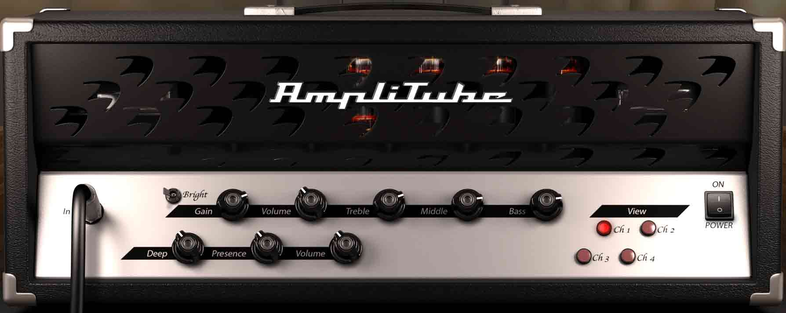   | VHandcraft_4 | Diezel VH4   | Diezel  | 1992年当時のまま製造されているこのアンプは、ドイツの有名メーカーが初めて開発した象徴的なアンプであり、その肉厚なサウンドは現代音楽のヘビートーンに多大な影響を与えました。その結果、明瞭で厚みのあるサウンドが生まれます。ヘビープレイヤーにとって必携のアンプです。   | Still made as in 1992, this is the first iconic amp of a famous German manufacturer that influenced a lot modern music’s heavy tones with its meaty sound. The result is articulate and thick. A must have for heavy players.  |
| 14  |  | MAZ_18_Jr| Dr. Z® MAZ 18 Jr. Model  | Dr. Z   | 1984年に発売されたMESA/Boogie Mark IIIは、世界初の3チャンネル「トライモーダル・アンプ」でした。驚異的なサウンド・スカルプティング・オプションに加え、リズム、特徴的な中音域の「クランチ」リズム、そしてリードの3チャンネル構成を誇り、それぞれ独立したゲインとマスターボリューム・コントロールを備えています。ハードウェア版と同様に、豊富なトーンコントロールに加え、極めて重要なBoogie 5バンド・グラフィックEQセクションも搭載しています。   | This amp features EL84 output tubes, 12AX7 and 12AT7 preamp tubes, along with a GZ34 rectifier tube, and delivers a much bigger sound than its 18W rating would indicate. Our model faithfully recreates the smooth top end and tight bass response of the amp's tone, as well as its awesome 3D reverb. Whether you're using humbuckers or single-coil pickups, the Maz 18 Jr. will deliver plenty of definition, headroom and signature tone.|
| 15  |  | Z_Wreck  | Dr. Z® Z Wreck Head Model| Dr. Z   | ロックするほどに鳴り響き、トゥワングするほどの音色、そして驚異的なタッチ感度とキラートーン。この30Wチューブヘッドのボリュームを12以上に上げると、クランチサウンドが鳴り始めます。ボリュームを上げて、その叫び声を聴いてみてください。アンプをクランチに設定し、ギターのボリュームを絞ると、耳障りな音のないクリーントーンが得られます。 | It rocks, it twangs, and it provides incredible touch sensitivity to go along with killer tone. Push the volume past 12, on this 30W tube head and it will start getting crunchy. Turn the volume up higher and listen to it scream. With the amp set for crunch, roll off your guitar volume to get a clean tone without harshness.   |
| 16  |    | E650 | ENGL® E650 Head Model| ENGL| G37は、その紛れもないトーン特性で、あらゆるジャンルのギタリストから高い評価を得ています。内蔵のソリッドステート・ギターアンプと真空管プリアンプ部は、澄み切ったクリーンサウンドから、力強い響きまで、レスリースピーカーならではの多彩なニュアンスを、ギターに最適なヴィンテージ・ボイスのV30 12インチ・スピーカーを搭載したコンパクトなデュアルローター・キャビネットを通して実現します。キーボード奏者向けに、よりポータブルなアンプとして設計されたStudio 12も、真空管駆動のソリッドステートアンプをデュアルローター・キャビネットに搭載し、オルガンの幅広い低音域に合わせて12インチのEminenceベース・スピーカーを搭載しています。   | This model is based on the ENGL® E650 amp head which was designed as an evolution of the previous Savage technology. The amp design features two switchable channels with selectable HI/LO gain ranges, which share EQ settings, additional contour and bright switches to fine tune midrange and high end response. This effectively makes it a four channel amp. E650 is capable of a vast array of tones, from sparkling cleans to bone crunching distortions and lead tones. Many in between and crunch sounds can be found by judiciously setting the gain and tone controls. |
| 17  |  | Powerball| ENGL® Powerball Head Model   | ENGL| Pro Juniorは、ボリュームとトーンを1つずつコントロールし、低音量ではクラシックなFender®トーン、音量を上げれば力強いビートを生み出すという、他に類を見ない融合を実現しています。タッチセンシティブなオーバードライブ・スタジオトーンを実現する優れたアンプで、世界中のプレイヤーが、プラグインしてボリュームを上げるだけで、シンプルでピュアなブルースやロックの演奏を楽しめるというシンプルな喜びを発見しています。 | The Powerball is based on one of the most powerful modern high-gain amplifiers from the ENGL® brand. It’s highly regarded for its heavy rhythm tones and its many sound-sculpting options. The Powerball has two main channels, and then each channel has two different modes. Channel I offers “Clean” and “Crunch,” and Channel II has “Low Lead” and “High Lead.” The Powerball has the power and flexibility to create everything from modern super high-gain leads to heavy crunch rhythms to crystal-clear clean tones.  |
| 18  | 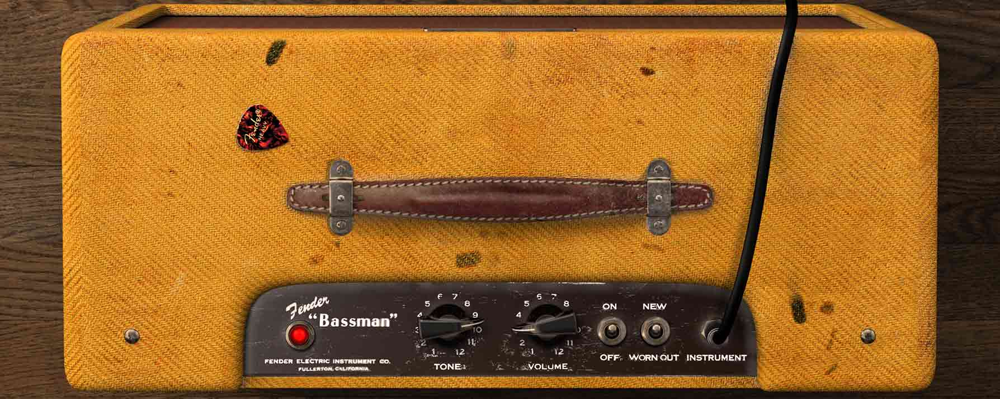   | 53_Bassman   | 53 Bassman® Model| Fender  | 26ワット、15インチシングルのオールチューブコンボ。’57 Custom Proは、豊かな倍音構成で知られる50年代のオリジナルProをベースにしています。このモデルは、伝説的なフレキシブルでヴィンテージなサウンドを提供します。クリーミーなオーバードライブと滑らかな存在感は、あらゆるヴィンテージトーンに最適で、モダンなサウンドにも抜群の効果を発揮します。15インチシングルスピーカーは、明瞭でありながらわずかにロールオフされた高音域を実現し、ドライブ時の耳障りな音を抑えつつ、ハムバッキングで鳴らした際の低音域のパンチと唸りを維持します。| 26-watt, single 15" all-tube combo. The original Fender Bassman was born as a 26-watt 1x15” speaker bass amp, the first Fender bass amp ever created. The original 26w 1x15" format was relatively short lived — only 660 units were ever produced. This model is based on an original ’53 and was designed to accentuate the P bass introduced just two years earlier. It also features an “aging” switch that lets you toggle between the two styles of vintage models for best of both worlds — new old stock like you just picked up a new one from the shop, or “worn” vintage for that well-aged, broken-in sound.   |
| 19  |  | 57_Bandmaster| 57 Bandmaster™ Model | Fender  | 40ワット、2x12インチのオールチューブコンボ。オリジナルの「低出力」40Wツイードアンプは、甘く歌うようなトーンとレスポンスの良いダイナミクスで知られています。’57 Custom Twin-Ampは、ツインアンプならではの、紛れもない豊かさ、透明感、そしてきらめきをプラスした、贅沢なクリーントーンを提供します。強めの音を叩くと、このクラシックモデルは高出力モデルよりも早く立ち上がり、低音域ではスムーズなオーバードライブ・クランチを提供します。滑らかな低音、高音、そして存在感を完璧に再現したこのモデルは、比類のないインタラクションと、驚くほど幅広く多様なサウンドパレットを提供します。  | 26-watt, 3x10" all-tube combo. This model is defined by vintage blues tone from a 3x10 set up and handwired all tube construction. Designed as a “plug straight in and turn it up” amp, the sound is flexible and fills the room with its vibe, giving the impression of a 3D surround sound. The crunch and cleans are different from other well known amps in the ’57 Custom series, and it will really make the difference in your rig. |
| 20  |    | 57_Champ | Fender® '57 Champ® Model | Fender  | レオ・フェンダーが設計した初期のアンプの一つであり、最も影響力のあるアンプの一つです。Tweed Deluxeは、音量を最大にするとクラシックなコンプレッションのかかったオーバードライブ・トーン、そして低音量では豊かな倍音を持つクリーン・トーンが得られます。Deluxeは、シカゴ・スタイルのブルース・トーン、カントリー、初期のロックンロール・トーンに最適なアンプです。今日では、あらゆるジャンルの現代のプレイヤーが、スタジオでDeluxeを使い、独自の「トーン・マジック」を生み出しています。| Out of the late 1950s comes the prized compact tweed amp that is revered for both practice and recording because of its low, 5-watt output. With the volume turned all the way up, you can manipulate your tone using the guitar's own controls to go from glassy clean to bluesy overdrive with the amp reacting to the input signal just the way you want it to. Small but mighty, the '57 Champ is a true classic that belongs in the amp collection of every dedicated guitarist.  |
| 21  |  | 57_Custom_Champ  | 57 Custom Champ® Model   | Fender  | おそらく史上最も有名なギターアンプ、ツイードBassman®は、真の音色愛好家にとって必携のアンプです。1950年代、当時発明されたばかりのFender® Precision® Bassギターのアンプとして考案されたこのアンプは、きらめくクリーントーンと、ロックンロールに最適なクランチトーンを生み出すギタリストたちに瞬く間に受け入れられました。このトーンは、60年代以降に活躍したブリティッシュ・スタック・アンプの礎となりました。クリーントーンでもディストーションでも、ロックからブルース、カントリーまで、外部エフェクトの有無を問わず、’59 Bassman®は幅広いジャンルの素晴らしいトーンを生み出す基盤となっています。  | 5-watt, single 8" all-tube combo. Probably THE most recorded amp of the time, the '57 Custom Champ provides an amazingly diverse tone palette for a small, one-knob amp. It's the perfect companion for those who love dynamic overdriven tones and crisp, classic cleans. |
| 22  | 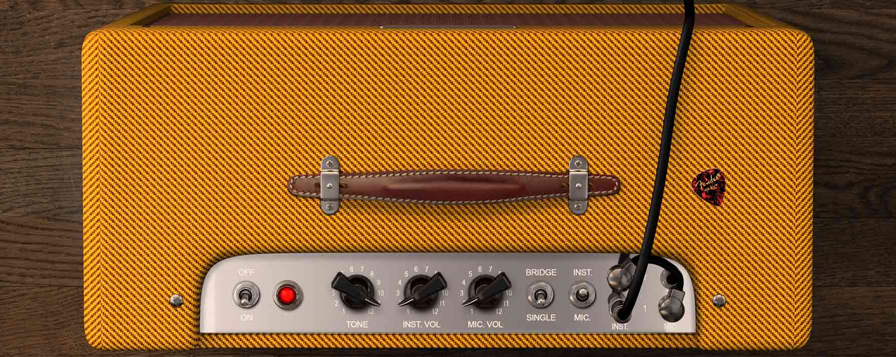   | 57_Custom_Deluxe | 57 Custom Deluxe™ Model  | Fender  | スティーヴィー・レイ・ヴォーンのオリジナルVibroverbをベースに、“アンプ・ドクター”セザール・ディアスがモディファイを施したハンドワイヤード・リイシュー。ブラックフェイス回路と15インチ・スピーカーが生み出す、きらめくクリーントーンは、ジャズやカントリーに最適です。「Mod」モードを選択すれば、プリアンプの真空管ディストーションとパンチの効いた中域が特徴的な、かの有名なテキサス・ブルース・トーンを再現できます。| 12-watt, single 12" all-tube combo. One of the most loved Fender tweeds of all time, this amp has it all – virtually everything from sparkling cleans to major crunch and everything in-between. The handwired all-tube 5E3 circuit is pure magic at all volume levels. The Tweed Deluxe was the favorite tone of its inventor due to the astonishing presence and harmonic characteristics. This custom tweed version is almost a fairy tale — a beauty outside and a beast in sound. |
| 23  |  | 57_Custom_Pro-Amp| 57 Custom Pro-Amp Model  | Fender  | ナッシュビルからリバプールまで、クラシックなカントリー＆ロックのトーンを奏でる真のクラシック。デラックス・リバーブは、明るくパンチの効いたアタックが特徴で、フィンガーピッキング、ガレージロックなど、あらゆるジャンルに最適です。ピュアなチューブトーン、優れたリバーブとトレモロ、そして驚くべき汎用性により、数え切れないほどのレコーディングで使用されてきました。| 26-watt, single 15" all-tube combo. The ’57 Custom Pro is based on the original Pro of the ’50s known for its rich harmonic content. This model delivers a legendary flexible and vintage sound. The creamy overdrive and smooth presence are perfect for all vintage tones and incredible for modern sounds. The single 15" speaker delivers defined yet slightly rolled off highs to reduce harshness when driven yet retains the low end punch and growl when hit with a humbucker. |
| 24  |    | 57_Custom_Twin-Amp   | 57 Custom Twin-Amp™ Model| Fender  | 最高級の真空管アンプのトーン、自然でダイナミックなクリーントーン、オーバードライブトーン、そして紛れもないフェンダーのスプリングリバーブとチューブビブラートを求めるあなたに、’65 Princeton Reverb Vintage Reissueが登場。1960年代の伝説的モデルPrinceton Reverbは、当初は練習用に設計されていましたが、その力強い真空管サウンドと、スタジオアンプとして愛用した無数のギタリストたちのおかげで、’65 Princeton Reverbはフェンダーアンプの中でも伝説的なコレクターズアイテムの一つとなりました。  | 40-watt, 2x12" all-tube combo. The original “low-powered” 40W tweed beauty is known for its sweet, singing tone and responsive dynamics. The ’57 Custom Twin-Amp delivers a luxurious clean tone that adds that certain unmistakable richness, clarity and sparkle as only a Twin can do. When hit hard, this classic model breaks up earlier than the higher powered cousin delivering smooth overdriven crunch at lower levels. The smooth bass, treble and presence are perfectly recreated in this model to offer an unmatched interactivity and a surprisingly wide and diverse sonic palette.|
| 25  |  | 57_Deluxe| 57 Deluxe™ Model | Fender  | 45ワット、4x10インチのオールチューブコンボ。’65 Super Reverbは、トーンの歴史において特別な位置を占め、世界中のプレイヤーの心を掴む、コレクターズアイテムとして欠かせない定番アンプです。きらめくトーンとヴィンテージオーバードライブの快感を備えたこの伝説的なブラックフェイスアンプは、ミディアム出力でステージを埋め尽くすサウンドマシンです。あらゆるスタイルやジャンルのプレイヤーが、このモンスターアンプからレコーディングに最適なトーンを見つけることができるでしょう。Super Reverbは、スプリング駆動による豊かなリバーブと、数え切れないほどのレコードで耳にしたトレモロ回路を備えた、幅広いトーンレンジを備えています。  | One of the first amplifiers designed by Leo Fender, and one of the most influential. The Tweed Deluxe provides classic compressed overdriven tones when cranked, and rich harmonic clean tones when played at low volumes. The Deluxe is a great amplifier for Chicago-style Blues tones, as well as Country and early Rock and Roll tones. Today, modern players of all stripes use a Deluxe in the studio to create their own “tone magic.”  |
| 26  | 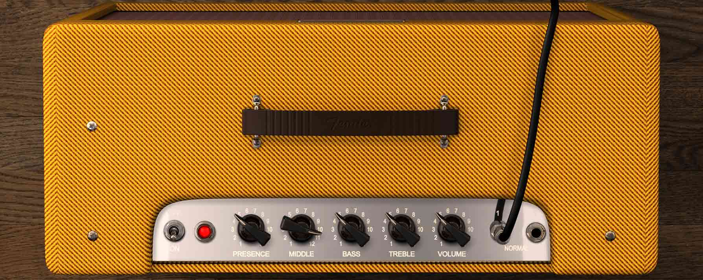   | 59_Bassman_LTD   | 59 Bassman® LTD Model| Fender  | 史上最も個性的なアンプの一つ。きらめくピュアなクリーントーンはどんな音楽スタイルにも完璧にマッチしますが、アリーナ級のボリュームでは力強い響きを放ちます。Twin Reverb®は、世界基準のFender®リバーブとトレモロを搭載した、初の人気内蔵エフェクトアンプとして知られています。また、外部ストンプボックスのキャラクターを際立たせるのにも最適なアンプで、非常に汎用性の高いプラットフォームとなっています。  | Quite possibly the most famous guitar amp of all time, the tweed Bassman® is considered a must-have for any serious tone connoisseur. Originally conceived in the 1950s to amplify the newly invented Fender® Precision® Bass guitar, it was quickly adopted by guitarists who found that it was able to provide shimmering clean tones and a cranked up “crunch” tone that lent itself perfectly to Rock and Roll. That tone became the basis for the famous British “stacks” of the '60s and beyond. Played clean or distorted, from Rock to Blues to Country, with or without external effects, the ’59 Bassman® is the foundation for a wide variety of great tones.   |
| 27  |    | 64_Vibroverb | 64 Vibroverb™ Custom Model   | Fender  | まさに定番中の定番。ポップス、ロック、ジャズ、ブルースなど、あらゆるジャンルの音楽にマッチするレスリーサウンドといえば、おそらく122を思い浮かべるでしょう。70年代初頭のビンテージユニットをモデリングしたこのモデルは、122Aと比べてやや温かみのあるサウンドが特徴です。   | A hand-wired reissue specifically based on Stevie Ray Vaughan’s original Vibroverb, as modifed by “Amp Doctor” Cesar Diaz. Its Blackface circuit and 15” speaker create a shimmering clean tone that is perfect for Jazz or Country. With the available “Mod” mode, the Vibroverb Custom can create the famous Texas Blues tone with its touch of preamp tube distortion and punchy mid focus. |
| 28  |    | 65_Deluxe_Reverb | 65 Deluxe Reverb® Model  | Fender  | Leslie 122Aは、最も有名なLeslieモデルの現代版です。アンプへのバランス入力と、優れた低音レスポンスを実現するミディアムハイトのキャビネットを備えています。クラシックな122と比べて、より開放的で前面に出る音色が特徴です。 | A true classic that delivers classic Country and Rock tones, from Nashville to Liverpool. The Deluxe Reverb has a bright, punchy attack that is perfect for finger-picking, Garage-Rock... just about anything. The Deluxe Reverb is an amp that has been used on countless recordings due to its pure tube tone, great Reverb and Tremolo, and amazing versatility.   |
| 29  | 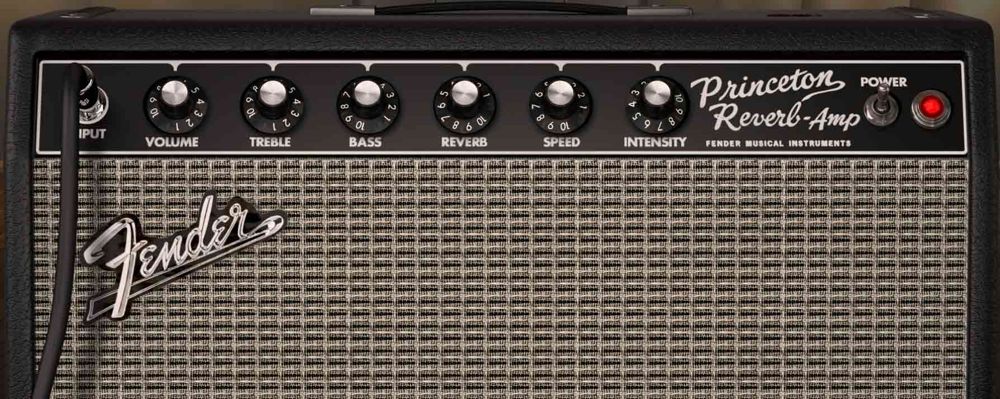   | 65_Princeton | 65 Princeton® Reverb Model   | Fender  | Leslie 147は、コネクタが異なり、パワーアンプも若干異なり、アンプへの入力はアンバランスで、キャビネットもやや短い、クラシックなLeslieモデルです。全体的なサウンドはクラシックな122と非常に似ていますが、音楽的に重要な違いがいくつかあります。私たちがモデリングしたのは60年代半ばのビンテージユニットで、ホーンにリフレクターが付いていません。これがサウンドに新たな味わいを与え、クラシックな122とのより明確な音の違いを生み出しています。 | For anybody who craves top – notch tube driven tone, naturally dynamic clean, overdriven tones, and unmistakable long Fender spring reverb and tube vibrato, here is the new ’65 Princeton Reverb Vintage Reissue. The legendary Princeton Reverb of the 1960s was originally intended for practice purposes, but thanks to its big tube tone and the countless guitarists that chose it as a studio amp, the ’65 Princeton Reverb became one of the legendary prize collectibles among Fender amps.   |
| 30  | 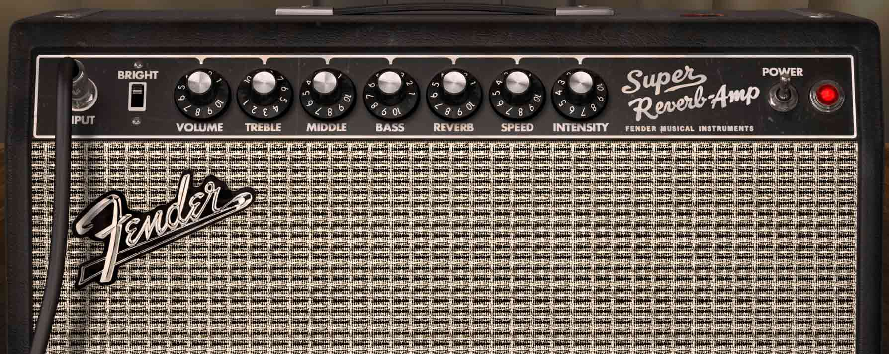 | 65_Super_Reverb  | 65 Super Reverb® Model   | Fender  | Leslie 3300wは、300ワットRMSのソリッドステートアンプと本物の真空管プリアンプを搭載した、史上最もパワフルなモデルの一つです。そのサウンドシグネチャーは、ポップ、ロック、ジャズ、ブルースに最適です。| 45-watt, 4x10" all-tube combo. The ’65 Super Reverb is another classic collectible workhorse amp that has a special place in tone history and in the hearts of players everywhere. With shimmering tone and vintage overdrive pleasure, this legendary blackface amp is a medium output stage-filling sound machine. Players of all styles and genres will find the perfect tone for their recordings in this beast. The Super Reverb features spring-driven lush reverb and a huge range of available tones with a tremolo circuit you’ve heard on countless records. |
| 31  |    | 65_Twin_Reverb   | Fender® ’65 Twin Reverb® (Vibrato Channel) Model | Fender  | このアンプは、史上最大かつ大胆なロックバンドの一つで長年にわたりツアーやレコーディングに使用されました。クラシックロックのトーンを自然に奏でるだけでなく、歴史上最も有名なジャズベーシストの一人が使用したことでも知られています。ソリッドステートでありながら、力強く堂々としたサウンドを誇るこのアンプで、容赦なくベースを弾きこなしましょう。   | One of the most distinctive amps of all time. It delivers a shimmering, pure clean tone that is perfect for any style of music, yet it will bark when turned up to arena volume. The Twin Reverb® is known as the first popular “built- in effects” amp, with world-standard Fender® Reverb and Tremolo. This is also a great amplifier for accentuating the character of external stomp boxes, making it an incredibly versatile platform to build on.|
| 32  |  | American_Tube_Clean_1| Fender® SuperReverb® | Fender  | このアンプは、クラシックなアメリカンギターアンプをモデルにしています。クリーンからダーティーなサウンドまで幅広く対応し、クリーンでクランチなリズム、ロック、カントリー、ブルースなど、音楽の要求に応じてクリーンでありながらダーティーなサウンドも生み出せるアンプが求められるあらゆるジャンルに最適です。  | This amp is modeled after a classic American guitar amp. This amp is great for clean to dirty sounds, making ideal for clean and crunchy rhythm, rock, country, blues, and anything else requiring a clean amp capable of getting a little dirty when the music calls for it.  |
| 33  |  | American_Tube_Clean_2| Fender® Deluxe Reverb®   | Fender  | このモデルは、もう一つのクラシックなアメリカンアンプを搭載しています。American Tube Clean 1とは異なり、このモデルは小型のコンボアンプです。クリーンでありながら温かみのあるトーンを実現します。 | This model features yet another classic American amplifier. Unlike the American Tube Clean 1, this model is a smaller combo amp. This amp delivers a clean yet warm tone.  |
| 34  |  | American_Tube_Vintage| Fender® Bassman® | Fender  | このクラシックなアメリカンアンプは、当初はベースアンプとして設計されましたが、後にアメリカンギターアンプの中でも最も人気のあるアンプの一つとなりました。クリーントーンに最適で、様々な音楽ジャンルや演奏スタイルにも幅広く対応します。| This classic American amplifier was at first designed to be a bass amp, but later became one of the most popular American guitar amps ever made. Great for clean tones, it is also versatile in a variety of music genres and playing styles.  |
| 35  |    | American_Vintage_B   | Fender® Bassman® Silverface  | Fender  | このアンプのデザインは多くの後継機種に影響を与え、ジミ・ヘンドリックスの「Voodoo Child」のスタジオ録音でも使用されました。| The design of this amp influenced many of its successors and was used by Jimi Hendrix in the studio recording of "Voodoo Child".   |
| 36  |    | American_Vintage_D   | Fender® Dual-Showman®| Fender  | ヘンドリックスはこの100ワットのアンプを1968年に購入し、1968年と1969年のエクスペリエンス・ツアーで、他のアンプと共に使用しました。このアンプにはスプリング・リバーブが内蔵されており、当初は15インチのJ.B. Lansing®スピーカーが2基搭載されていました。 | Hendrix acquired this 100 watt amp in 1968 and used it in '68 and '69 with the Experience tour together with an assortment of other amps. The amp sported a built-in spring reverb unit and originally came with 2x15" J.B. Lansing® speakers. |
| 37  |    | American_Vintage_T   | Fender® Twin Reverb® Silverface  | Fender  | 1965年から1966年にかけて、ジミ・ヘンドリックスが愛用したアンプです。スプリングリバーブと2基の12インチJ.B. Lansing®スピーカーを搭載していました。   | This was Jimi Hendrix's amp of choice during '65 through '66. It included a spring reverb and was equipped with 2x12" J.B. Lansing® speakers.  |
| 38  | 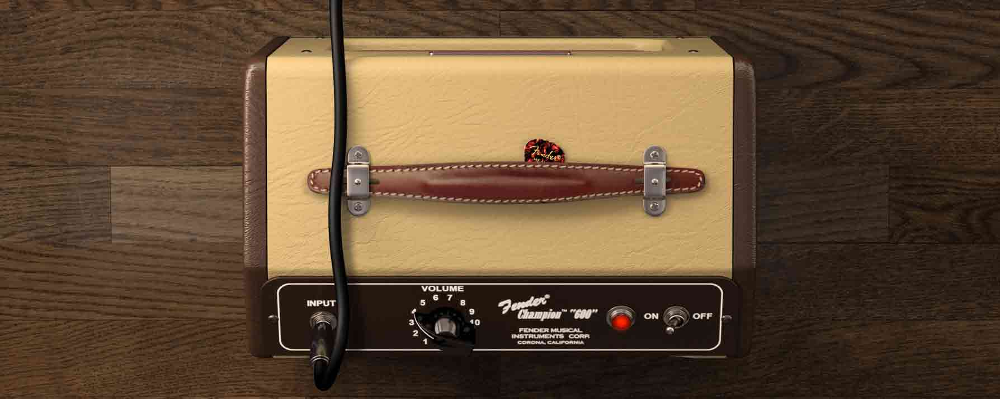   | Champion_600 | Champion™ 600 Model  | Fender  | クラシックなAmpliTubeモデルをベースにしたこのアンプは、エッジの効いたディストーションサウンドを生み出す、非常に高いゲインを備えています。モダン・チューブ・リードサウンドに似たサウンドですが、Modern Hi-Gainは、そのサウンドに新たな解釈を加えます。 | The Champion™ 600 is an updated version of the classic Fender® practice amp, providing slightly more gain than the original model. With only a volume control, a clean, simple circuit with just one power tube and low wattage, its distinctive reedy tone has been used on countless Classic Rock recordings.|
| 39  |    | MH-500_Metalhead | MH-500 Metalhead™ Model  | Fender  | Mark Vは単なるアンプではなく、9つのアンプを1台に凝縮したようなアンプです。画期的なMark I™、Mark II™、Mark IIC+、Mark III、Mark IVなど、MESA/Boogieの歴史を全て再現したこのユニークなモデルには、数々のアンプが搭載されています。さらに、6L6とEL34を切り替えられる真空管セレクター、ダイオード/真空管、五極管/三極管を切り替えるリアスイッチなど、その汎用性は格段に向上し、ディストーションギタートーンの歴史を網羅したサウンドを堪能できます。  | Designed from the ground up to provide the perfect amp for modern down-tuned and 7-string guitarists, with a searing gain and a punishing low end that is perfect for more agressive styles of Rock and Metal. Its solid-state power amp gives enough headroom for incredible note definition even when distorted, and the preamp has an unmatched amount of gain for lead players.|
| 40  | 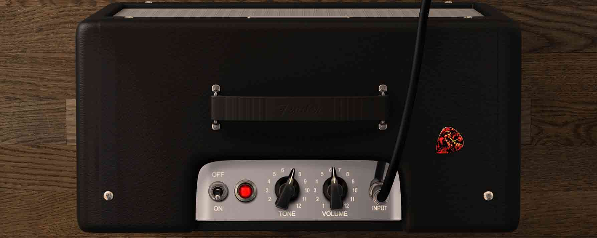   | Pro_Junior   | Pro Junior™ Model| Fender  | 60年代の逸品であるこのアンプは、リッチー・ブラックモア、ジミー・ペイジ、ジョー・ペリー、そして時にはスティーヴィー・レイ・ヴォーンといったプレイヤーによって有名になったMarshall Major 200「Pig」（愛称）をベースにしています。元々はステージ上の音量をより大きくしたいプレイヤーのために開発され、KT88パワー管を搭載した200ワットの出力を誇りました。大型トランスを搭載するため当時のMarshallよりも3インチも奥行きが深くなっていたことから「The Pig」の愛称で呼ばれ、すぐに大規模な会場で活躍するプレイヤーの間で人気を博しました。  | The Pro Junior, with its single volume and tone controls, is a unique marriage of classic Fender® tone at low volumes and angry bite when cranked. This amp is excellent at achieving touch-sensitive overdriven studio tones, and players everywhere have discovered the simple joys of plugging in and turning up the volume for simple, pure Blues and Rock performance.|
| 41  |  | Super-Sonic  | Super-Sonic™ Model   | Fender  | TBP-1は、フェンダーのパッシブ・トーン・スタック（Twin Reverb®やShowman®などのクラシックな設計に採用）をベースに設計された、真にプロフェッショナルなチューブ・ベース・プリアンプです。クリーミーなチューブ・トーンを実現しながらも、楽器本来の音色を際立たせます。チューブ・オーバードライブ・セクションが「バイト」を加え、Vari-Q™回路がモダンなアクティブ・トーン・シェイピングを実現します。厚みがあり、ナチュラルでバランスの取れたサウンド。TBP-1は、素晴らしいベース・トーンを生み出すための驚異的なデバイスです。 | A marriage of classic Fender® tone and modern versatility, perfect for everything from vintage clean tones to '70s-style Classic Rock crunch to modern Metal and Punk. Its independent cascading gain stages and custom EQ allow guitarists to create a huge variety of both vintage and modern harder-edged distorted tones, all while retaining that unmistakable Fender® character. |
| 42  |  | TBP-1| TBP-1 Bass Preamp Model  | Fender  | これはTHD® BiValveのモデルです。このモダンなブティックアンプは、ステージでもスタジオでも非常に人気があります。シングルエンドのクラスA設計を採用し、幅広いトーンを表現できます。クリーンからクランチー、そして重厚なサチュレーションまで、THD BiValveはあらゆるトーンを簡単に作り出すことができます。 | The TBP-1 is a truly professional tube bass preamp designed around Fender’s passive tone stack (used in classic designs such as the Twin Reverb® and Showman®) which delivers creamy tube tone while allowing the color of the instrument to shine through. A tube overdrive section adds “bite”, while the Vari-Q™ circuit provides modern active tone shaping. Thick, natural and balanced; the TBP-1 is an amazing device for creating great bass tone. |
| 43  |    | Vibro-King   | Vibro-King® Custom Model | Fender  | このモダンなフェンダー®のクラシックアンプは、驚異的なクリーントーン、比類なきタッチ感度、そしてあらゆるプレイヤーの芸術的インスピレーションを刺激する厚みのあるオーバードライブ特性を備えています。FATスイッチをオンにすると、クラシックなロックディストーションへとブーストされます。Vibro King®はフェンダー®独自の’63リバーブ回路も搭載しており、カントリー、ブルース、サーフといったジャンルのプレイヤーにも最適です。 | This modern Fender® classic provides incredible clean tones, unequalled touch sensitivity, and a thick overdrive character that will inspire artistic inspiration for any player. Engaging the FAT switch helps boost it into classic Rock distortion. The Vibro King® also contains Fender®’s unique ’63 Reverb circuit, which means this amplifier is a perfect choice for Country, Blues, and Surf players, as well.|
| 44  | 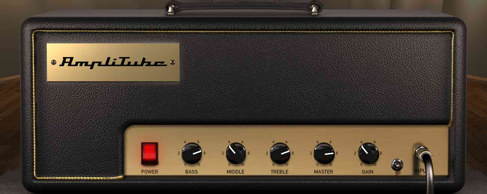 | MiniPlex_20  | Friedman Pink Taco PT-20.| Friedman| このアンプは、現代のハードでドライブ感のあるロックトーンの先駆者の一つをモデル化したものです。焼けつくようなリードサウンドからヘビーなクランチサウンドまで、他に類を見ないモダンロックトーンを生み出すために改良されています。| Super versatile and powered by EL84, this American model provides great tones from blues to heavy metal with just a few knob tweaks. This model loves to take pedals from Overdrives to Modulation effects and reacts exceedingly well to the player’s performance with its harmonically rich and resonating tone. |
| 45  |    | MB_150_S | Gallien-Krueger® MB150™ Model| Gallien-Krueger | Mesa Engineeringのシグネチャー・ハイゲイン・サウンドを体現するこのアンプは、1990年のクラシックなMark IIIデザインをアップデートしたもので、あの紛れもないBoogieトーンをさらに磨き上げ、サウンドの多様性をさらに高めています。3つのサウンドと個別のコントロール、そして揺るぎないサウンドが、このパワフルなアンプのトーンパレットを決定づけます。3チャンネル構成のアンプは、きらめくクリーンから、倍音とサスティンに富んだ超ハイゲイン・リードサウンドまで、驚くほど幅広いサウンドパレットを提供します。  | This is a rendition of THE bass combo for double bass. The tone doesn't stop there, though. Electric bassists have used this tiny but mighty (and toneful) combo amp with great success. Great things can come in small sizes, and can sound suprisingly big and full. |
| 46  |  | HiAmp| Hiwatt® DR103™ Amp   | Hiwatt  | 名前に「ジャズ」と付いていますが、この万能なクリーンサウンドは様々なジャンルで聴くことができます。多くのトップメタルプレイヤーが、素晴らしいクリーンサウンドを生み出すために、この秘密兵器をスタジオに常備しています。| HiAmp is based on one of the most legendary British tube amplifiers. This amp’s full-bodied, warm sound characterized countless music productions and performances in the '70s and early '80s. The amp was highly valued for its warm clean and its powerful crunch tones. |
| 47  |  | Custom_Modern_Hi-Gain| Modern Hi-Gain AmpliTube model   | IK Multimedia   | このアンプモデルはクリーンです。ギターに非常に色付けのない信号を送り、ジャズに最適です。Jazz Amp 120のようなアンプに匹敵し、きらびやかなクリーントーンに最適です。| Based on the classic AmpliTube model, this amp features LOTS of gain for that over the edge distortion sound. Similar to modern tube lead sound in character, Modern Hi-Gain provides an additional take on that type of sound.|
| 48  |  | Custom_Solid_State_Fuzz  | Solid State Fuzz AmpliTube model | IK Multimedia   | AmpliTube 1 のファズ アンプをベースにしたこのモデルは、60 年代のファズ サウンドを彷彿とさせる、非常に独特で歪んだサウンドです。   | Based on AmpliTube 1’s fuzz amp, this model is a very distinct and distorted sound, reminiscent of '60s fuzz sounds.   |
| 50  |  | Custom_Solid_State_Lead  | Solid State Lead AmpliTube model | IK Multimedia   | 非常に人気の高いRandall® RG 100 ESソリッドステート120ワットアンプを忠実に再現。このアンプのサウンドとトーンは、パンテラ初期のダイムバッグ・ダレルが使用し始めたことで有名になりました。 | This model features a precise solid state lead sound. It has a darker tone and excels at high gain lead tones. It is very suitable for hard rock leads and its gain is very stable, making it easy to use at low volume levels.|
| 51  |  | Solid_State_Bass_Preamp  | Solid State Bass AmpliTube model | IK Multimedia   | Ampeg SVT-VRは、1970年代初頭の「Blue-Line」SVTヘッドのヴィンテージ復刻版です。プリアンプ段、パワーセクション、そしてロッカースイッチに至るまで、オリジナルのロックンロールの主力機種のシグナルパス、トーン、そしてバイブレーションを忠実に再現しています。まさに70年代最高のロックベースアンプの再現と言えるでしょう。 | This model features a solid state bass preamp, EQ, and a solid state power amp module. It cleans up beautifully and drives just as hard.   |
| 52  | 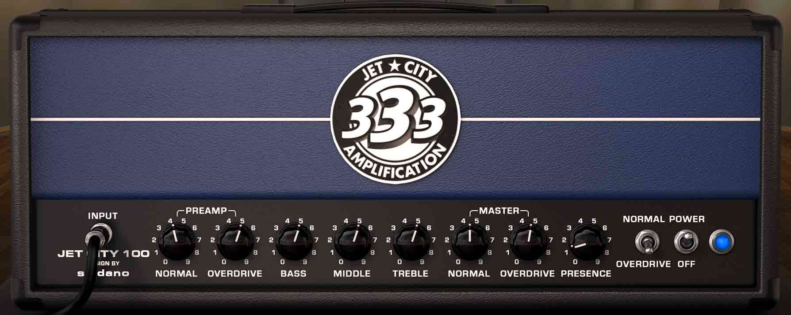 | JCA100H  | Jet City Amplification 333® JCA100H™ Model   | Jet City| 1986年製Roland® JC-120™をベースにしたこのステレオアンプは、「Cemetery Gates」で使用されました。アルバム「Cowboys From Hell」で聴けるトーンと全く同じになるよう微調整されています。 | With two channels of Soldano tone and its pure tube power, this amp was made for the big stage. The Normal channel has plenty of headroom to deliver clear, bright clean tones and can also be driven hard enough to get downright raunchy. The Overdrive channel is based on the the circuit that made Soldano famous.|
| 53  |    | JCA20H   | Jet City Amplification 333® JCA20H™ Model| Jet City| ソルダーノのトーンと純粋な真空管パワーを2チャンネル搭載したこのアンプは、大きなステージでの使用に最適です。ノーマルチャンネルは十分なヘッドルームを備え、クリアで明るいクリーントーンを生み出すだけでなく、ハードにドライブすることで荒々しいサウンドも生み出せます。オーバードライブチャンネルは、ソルダーノを有名にした回路をベースにしています。 | Pure, simple and full of tube tone, JCA20H is a single-channel amp with absolutely no gimmicks or unnecessary features that might otherwise dilute the all-tube signal path. With full EQ control and separate Preamp and Master volumes, JCA20H can deliver tones from spanky clean through crunchy overdrive.|
| 54  |  | 122  | Leslie® 122  | Leslie  | 26ワット、シングル15インチ、オールチューブコンボ。オリジナルのFender Bassmanは、26ワット、1x15インチスピーカーのベースアンプとして誕生し、Fender初のベースアンプとなりました。オリジナルの26ワット、1x15インチモデルは比較的短命で、生産台数はわずか660台でした。このモデルはオリジナルの’53をベースに、そのわずか2年前に発表されたPベースを引き立てるデザインとなっています。また、ヴィンテージモデルの2つのスタイルを切り替えられる「エイジング」スイッチを搭載し、まるでお店で買ったばかりの新品のような新古品のようなサウンドと、使い込まれたヴィンテージのようなサウンドを両立しています。 | The classic of classics. Suitable for pop, rock, jazz and blues, when you think of the Leslie sound, you are most likely thinking of a 122. A vintage unit from the early '70s has been modeled here, and this has a slightly warmer sound when compared to the 122A.  |
| 55  |    | 122A | Leslie® 122A | Leslie  | 26ワット、3x10インチのオールチューブ・コンボ。3x10のセットアップとハンドワイヤードのオールチューブ構造によるヴィンテージ・ブルース・トーンが特徴のモデルです。「プラグを差し込んですぐに音量を上げる」アンプとして設計されており、そのサウンドは柔軟性が高く、そのバイブが部屋中に広がり、まるで3Dサラウンドサウンドのような印象を与えます。クランチとクリーンは、’57 Customシリーズの他の有名なアンプとは一線を画し、あなたの機材に確かな違いをもたらします。 | The Leslie 122A is the modern take on the most famous Leslie model, with a balanced input to the amplifier and a medium-tall cabinet that provides superb bass response. This has a slightly more open and upfront tone when compared to the classic 122.  |
| 56  |  | 147  | Leslie® 147  | Leslie  | 1950年代後半に登場した、5ワットという低出力から練習にもレコーディングにも重宝される、貴重なコンパクトツイードアンプ。ボリュームを最大にすれば、ギター本体のコントロールを使って、透明感のあるクリーントーンからブルージーなオーバードライブまで、思いのままにトーンを操ることができます。アンプは入力信号に的確に反応します。小型ながらもパワフルな'57 Champは、真のクラシックであり、すべての熱心なギタリストのアンプコレクションに欠かせない存在です。| The Leslie 147 is another classic Leslie model with a different connector, slightly different power amp, an unbalanced input to the amplifier and slightly shorter cabinet. The overall sound is very similar to the classic 122 but with some noticeably and musically relevant differences. The one we modeled is a vintage unit from the mid '60s, with no reflectors on the horns, which gives another flavor to the sound and an even more tangible sonic difference from the classic 122.|
| 57  |  | 3300W| Leslie® 3300 | Leslie  | 5ワット、8インチシングルのオールチューブコンボアンプ。当時最も多くレコーディングされたアンプと言えるでしょう。'57 Custom Champは、小型のワンノブアンプながら、驚くほど多彩なトーンパレットを提供します。ダイナミックなオーバードライブトーンと、歯切れの良いクラシックなクリーントーンを好む方に最適なアンプです。 | The Leslie 3300w is one of the most powerful models ever, featuring a 300-Watt RMS solid-state amplifier with a real vacuum tube preamp. Its sound signature is especially suitable for pop, rock, jazz and blues. |
| 58  | 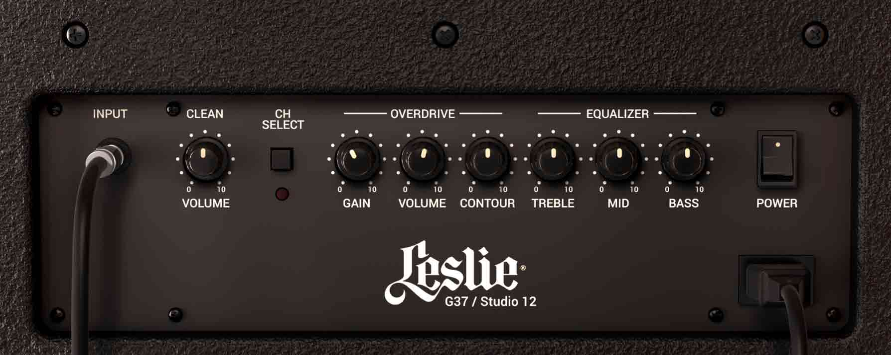   | G37-St12 | Leslie® G37  | Leslie  | ドイツ人クリエイターがブティックサウンドをこのアンプに注ぎ込みました。EL34エンジン搭載のこのアンプは、夢のトーンを極限まで高めるために必要なすべてを備えています。澄み切ったクリーントーンからエッジの効いた激しいディストーションまで、幅広いサウンドを奏でます。クリーントーンのグリーン、お馴染みのオーバードライブ・ブルー、そしてハイゲイン・トーンのレッドの3チャンネルを備えています。  | Guitarists of all kinds praise the G37 for its unmistakable tonal character. The onboard solid-state guitar amplifier with its tube preamp section can go from pristine-clean to down-and-dirty, for a variety of tonal nuances that only Leslie speakers can provide through a compact dual-rotor cabinet with a vintage voiced V30 12” speaker suited to guitar. The Studio 12, designed as a more portable amp for keyboard players, also uses a tube-driven solid state amplifier into a dual rotor design but has a 12” Eminence bass speaker tailored to the wider low frequency range of organs.|
| 59  |  | AFD_100  | Slash-Marshall® AFD100   | Marshall| スラッシュが使用した最もアグレッシブなアンプヘッド。過去30年間で最も重要なロックアルバムの一つ、「アペタイト・フォー・ディストラクション」の伝説的なトーンを再現するデュアルモードアンプ。 | The most aggressive amp head used by Slash. A dual mode amplifier that revisits the legendary tones of one of the most important rock albums of the last three decades: "Appetite for Destruction".|
| 60  |  | Brit_8000| Marshall® JCM800™ head.  | Marshall| Brit 9000は、90年代初頭に発表されたJCM800の「進化版」とも言えるJCM900をベースにしています。このデュアルチャンネル・デュアルリバーブヘッドは、チャンネル1はクリーントーンからクランクアップ時の低レベルのリードゲインまで幅広い音作りに対応し、チャンネル2は低ゲイン時には迫力あるリードトーン、高ゲイン時には叫び声のようなソロトーンまで、幅広い音作りを可能にする十分なゲインを備えています。   | The Brit 8000 is based upon the early '80s JCM800, the amp that although most think of the Plexi’s as the defining tone of a pushed Marshall, in reality it’s the JCM800 that people are hearing. The JCM800 was the first departure from the Plexi format designed for players who desired a “hotter” front end and more control over the overall output volume. The result? More preamp overdrive and crunch at controllable volumes.|
| 61  |  | Brit_9000| Marshall® JCM900™ head   | Marshall| マーシャル社創立25周年を記念した1987年モデルのMarshall Silver JubileeをベースにしたBrit Silverは、プリアンプ回路にクリーン、リズムクリップ、リードの3つのゲインモードを搭載しています。Silver Jubileeはまた、フルパワーからハーフパワーまで切り替え可能な出力セクションを搭載した初のMarshallモデルでもあり、適度な音量でもJCM800のトーンが得られます。Brit Silverは、オリジナルのSilver Jubileeを細部に至るまで忠実に再現し、真のMarshallトーンを余すところなく再現しています。| The Brit 9000 is based upon the early '90s introduction of the “evolution” of the JCM800, the JCM900. This dual channel, dual reverb head was designed for versatility with channel 1 voiced from clean to low level lead gain when cranked, and channel 2 voiced with enough gain to provide fearsome lead tones at low gain to screaming solo tones at high gain.|
| 62  | 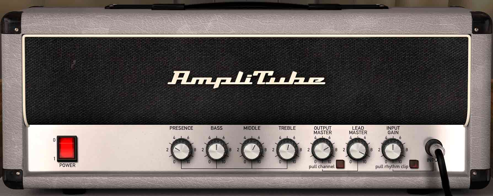 | Brit_Silver  | Marshall® Jubilee™ head  | Marshall| JMP-1は、Marshallが初めてMIDIコントロールの世界に進出したMarshall Toneのモデルです。プレイヤーは思い通りのトーンを作り、そのトーンプリセットを保存して、いつでもMIDIコントロールで呼び出すことができます。JMP-1は最もシンプルで分かりやすいプリアンプの一つです。ボリューム、ゲイン、ベース、ミドル、トレブル、プレゼンスといったMarshallの定番コントロールに加え、ベースシフト、2つのオーバードライブチャンネル、そして2つのクリーンチャンネルも備えています。その使いやすさと「すぐに使える」サウンドキャラクターから、JMP-1は瞬く間に当時を象徴するギタープリアンプの一つとなりました。当時のプロギタリストのほぼ90%が、JMP-1をコレクションに加えていました。| Based on the 1987 Marshall Silver Jubilee commemorating the 25th anniversary of the Marshall company, the Brit Silver features the 3-gain mode of the preamp circuit “clean”, Rhythm Clip and Lead. The Silver Jubilee was also the first Marshall to feature an output power section that could be switched from full to 1/2 power, thus providing that JCM800 tone at reasonable volumes. The Brit Silver faithfully recreates the original Silver Jubilee down to every minute detail for hyper-real authentic Marshall tone.   |
| 63  |    | Brit_Valve_Pre   | Marshall® JMP-1TM tube preamp| Marshall| これは、伝説的な英国製アンプのモデルです。このアンプは、史上最も広く知られ、人気のあるアンプの一つです。その伝説的なトーンは、その生涯を通じて、多くのロックの創始者（リバプール出身の4人を含む）の名を世に知らしめ、今日でも多くのアルバムで聴くことができる、非常に人気のあるサウンドとなっています。   | The JMP-1 was Marshall’s first foray into the world of MIDI control with Marshall tone. It allows players to sculpt the tones they want, then save those tone presets for recall by MIDI control at any time. It’s one of the simplest preamps, very straightforward. It has the staple Marshall controls like Volume, Gain, Bass, Middle, Treble and Presence. It features a bass shift, 2 overdrive channels, and 2 clean channels. For its ease of use and its “ready- to-go” sound character, it quickly became one of the most iconic Guitar preamps of the era. Almost 90% of the pro players at the time had a JMP-1 in their rack of toys. |
| 64  |  | British_Lead_S100| Marshall® 1959 JTM100™ Super Lead| Marshall| 80年代のハードロックファンに人気を博したこの英国製ギターアンプは、現代の多くのギタリストにとって貴重なトーンであり続けています。真空管アンプならではのサチュレーションサウンドを自在に操るこのモデルは、様々なヘビーロックギターサウンドを生み出す頼れるアンプです。| This is modeled on the Classic British 100 watt amp Jimi Hendrix is generally associated with. Jimi Hendrix often used multiple amp heads (up to 6) looping them together to get more power, a setup that can be recreated in AmpliTube because of its dual rig capability.|
| 65  |  | British_Tube_Lead_1  | Marshall® JCM800™| Marshall| British Tube Lead 1の弟分となるこのモデルは、素晴らしいロックトーン、リードサウンド、そしてヘビーなクランチサウンドを実現できます。よりザラザラとした、ややアグレッシブなサウンドでありながら、このアンプシリーズをロックギター界で広く知られる存在にしたクラシックなトーンは健在です。  | Made popular by the hard rockers of the '80s, this British guitar amp has remained a prized tone for many of today’s guitar players. Able to crank out great tube saturated tone and with ease this model is a go to amp for a variety of heavy rock guitar sounds.|
| 66  |  | British_Tube_Lead_2  | Marshall® JCM900™| Marshall| California Tweedは、ヴィンテージトーンの新たな境地を切り開くシンプルなデザインです。リバーブを内蔵したシングルチャンネルのシンプルさの中に、オールチューブならではの黄金のトーンが秘められています。マルチワットスイッチにより、2Wから40Wまでの様々な出力オプションから選択でき、このアンプの持つトーンの可能性を最大限に引き出します。 | The younger sibling to the British Tube Lead 1, this model is capable of great rock tone, leads, and heavy crunch. While grittier and a little more aggressive, it still has the classic tone that has made this family of amps a household name in Rock Guitar.   |
| 67  |  | JCM_Slash| Slash-Marshall® JCM SLASH 2555SL | Marshall| ピュアでシンプル、そして真空管サウンドを余すところなく再現するJCA20Hは、オールチューブのシグナルパスを損なうようなギミックや不要な機能は一切排除したシングルチャンネルアンプです。フルEQコントロールとプリアンプとマスターボリュームを独立して搭載し、スパンキーなクリーントーンからクランチーなオーバードライブまで、幅広いトーンを自在に操ります。 | The Marshall JCM Slash was designed to the specs of Slash's original 1987 Marshall Silver Jubilee 2555 amplifier. It was the first amplifier built by Marshall as a signature model.   |
| 68  |  | JH_Gold  | Marshall® JTM 45™| Marshall| JH 1200は高出力の真空管ベースヘッドです。1967年から1968年にかけて行われたヘンドリックスのコンサートでは、バックライン全体がSunnのアンプとキャビネットで埋め尽くされていたことがよくありました。サイケデリック時代の多くのアンプと同様に、超大音量の1200はギタリストとベーシストの両方に人気を博しました。   | “The” amp that Hendrix used almost exclusively from 1968 on. He liked to crank it to full volume and chain multiple heads to produce a huge, mind-blowing wall of sound. The new model has been reworked from the ground up, using IK’s DSM™ and SCC™ modeling technologies, and includes both the Normal and Treble channels, plus fully modeled channel bridging.|
| 69  |  | Red_Pig  | Marshall® MajorTM head   | Marshall| Rockerverbは、控えめに言っても「ダーティー」ですが、決して一つの技に特化しているわけではありません。まずはフルゲインから始めて、徐々にゲインを下げていくことで、Orangeのクラシックなトーンを幅広く体験できます。メタル、フュージョン、ブルース、ロック、さらにはカントリーなど、どんなジャンルでもRockerverbが期待に応えます。   | This gem from the '60s is based on the Marshall Major 200 “Pig” (as it was nicknamed) made famous by players like Ritchie Blackmore, Jimmy Page, Joe Perry and at times Stevie Ray Vaughan. It was originally produced for players who needed more stage volume and sported a full 200 watts powered by KT88 power tubes. Nicknamed “the Pig” because it was a full 3” deeper than Marshalls of the day to accommodate the larger transformers, it quickly became the favorite of larger venue players.|
| 70  |    | Satch_VM | Marshall® JVM410HJS™ | Marshall| BA-500は、あらゆる音楽シーンにおいて、力強く繊細なサウンドを実現する、高品位ソリッドステート・ベースアンプです。強力なプリアンプ・サウンド・シェイピング・コントロールにより、あらゆる音楽ジャンルにマッチします。BA-500のキャビネットと相性は抜群ですが、付属のキャビネット・オプションを駆使することで、様々なサウンドをお楽しみいただけます。 | Based on the Marshall® JVM410HJS, this versatile four-channel amp offers incredible tones possibilities. Customized to Joe’s unique design, this amp offers three modes per channel, along with independent noise filters and re-biased presence & resonance controls. |
| 71  |    | Vintage_Metal_Lead   | Marshall® JMP100™ Head   | Marshall| 70年代の誕生から、オーストラリアのハードロック、80年代のクレイジーなメタル、そしてそれ以降も変わらず愛され続ける、まさに永遠の定番アンプ。これほど長く、これほど激しくロックし続けられるアンプはそう多くありません。   | An all-time classic, from its origin in the '70s, through Aussie hard rock, crazy '80s metal and beyond. Few amps have rocked as hard, for as long.|
| 72  | 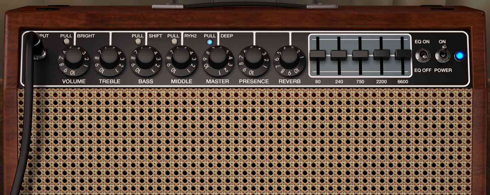   | American_Clean_MKIII | Mesa/Boogie® MKIII™ Combo - Clean Channel| Mesa Boogie | 人気と人気を誇るアメリカ製アンプのクリーンチャンネルを再現したモデルです。その特徴的なトーンは、世界中の多くのアルバムやステージで聴くことができます。きらめくクリーンサウンドに加え、ボリュームを上げた際にクランチサウンドも加えた、まさに至高のサウンドを体感してください。| This is a model of the clean channel from a popular and sought after American amplifier. The signature tone can be heard on many albums and many stages around the world. Experience a sparkling clean with the capability for a touch of crunch when cranked up.  |
| 73  | 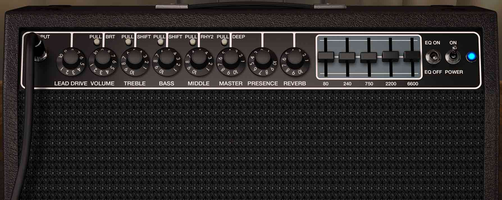 | American_Lead_MKIII  | Mesa/Boogie® MKIII™ Combo - Lead Channel | Mesa Boogie | これは、クリーンサウンドとリードサウンドの両方で優れたサウンドを生み出すことで知られる、名高い3チャンネル・アメリカンアンプのリードチャンネルです。カリフォルニアのクランチサウンドや、滑らかで味わい深いサスティンリードサウンドを求めるなら、このチャンネルは力強くアグレッシブなサウンドを生み出すことができます。| This is the lead channel of a renowned three-channel American amplifier, known for excelling at both clean and lead sounds. This channel can be BIG and aggressive when you want some California crunch and smooth, tasty sustained lead sounds too.   |
| 74  |    | California_Tweed | MESA/Boogie California Tweed™ model. | Mesa Boogie | Champion™ 600は、クラシックなFender®練習用アンプのアップデート版で、オリジナルモデルよりもわずかにゲインが高められています。ボリュームコントロールのみ、パワー管1本のみのクリーンでシンプルな回路、そして低ワット数という特徴的なリードトーンは、数え切れないほどのクラシックロックのレコーディングで使用されてきました。| The California Tweed has a simplistic design that raises the bar in the world of vintage tone. Its single channel simplicity with integrated reverb hides an all-tube golden tone. Its multi-watt switch lets you browse into a variety of power options from 2W to 40W to really take advantage of the tone possibilities of this amplifier.  |
| 75  | 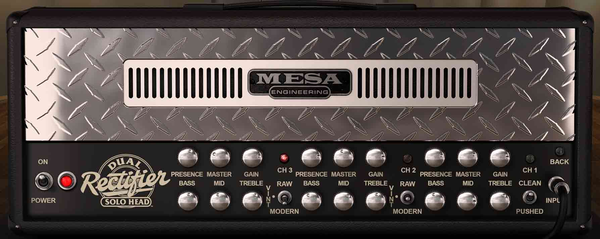   | Dual_Rectifier   | Mesa Boogie® Dual Rectifier® Head Model  | Mesa Boogie | ツインチャンネル30ワットギターヘッド。チャンネルごとにわずか3つのコントロールで、幅広いトーンレンジを実現する独自の2ステージプリアンプを搭載。Fatチャンネルはより温かみのあるトーンを、Tiny TerrorチャンネルはオリジナルのTiny Terrorのサウンド特性を継承しています。  | Soul, personality and feel — The MESA/Boogie Dual Rectifier is THE standard for modern high gain heavy guitar tone and more. The Recto is an aggressive amplifier designed for aggressive players — it's one of the most recorded amplifiers ever made and its tone can be heard rocking big-venue stages all over the world. Originally introduced in 1989, it delivers maximum flexibility of tone and has played a major role in defining the sound of grunge, metal and countless other heavy styles. It delivers 3-channel, 8-mode operation and varying levels of tube saturation as well as a virtually switchable tube/solid state rectifier section.  |
| 76  |  | Mark_IIC_plus| MESA/Boogie Mark IIC+™ model.| Mesa Boogie | このアンプは、EL84出力管、12AX7および12AT7プリアンプ管、そしてGZ34整流管を搭載し、18Wという定格出力からは想像できないほど力強いサウンドを生み出します。このモデルは、アンプの滑らかなトップエンドとタイトなベースレスポンス、そして素晴らしい3Dリバーブを忠実に再現しています。ハムバッキングピックアップでもシングルコイルピックアップでも、Maz 18 Jr.は明瞭度の高いサウンド、ヘッドルーム、そして特徴的なトーンを提供します。   | Among the most legendary amps in the MESA/Boogie line and heard on one of the greatest metal records of all time, this is John Petrucci’s favorite and the one on which he based his custom amplifier. When it comes to classic high-gain tones, the Mark IIC+ goes all in with its percussive characteristics and sound tweakability, thanks to its built-in equalizer.   |
| 77  |    | Mark_III | Mesa Boogie® Mark III™ Combo Model   | Mesa Boogie | これはダブルベースのための最高のベースコンボです。しかし、その音色はそれだけではありません。エレクトリックベーシストたちは、この小型ながらもパワフルで豊かな音色のコンボアンプを大絶賛しています。素晴らしいものは小型でも存在し、驚くほど大きく豊かなサウンドを生み出します。| Originally introduced in 1984, the MESA/Boogie Mark III was the first 3-channel “Tri-Modal Amplifier.” It features an amazing set of sonic sculpting options plus a three-channel setup: Rhythm, a distinct midrange “Crunch” Rhythm and a Lead channel — each with independent gain and master volume controls. Just like on the hardware counterpart, it sports a full spread of tone controls plus the vitally important Boogie 5-band Graphic EQ section.  |
| 78  |  | Mark_IV  | Mesa Boogie® Mark IV™ Combo Model| Mesa Boogie | この極めて高品質なアンプは、クリーンチャンネルにおいて非常に繊細でクリーンなレスポンスを実現し、驚くほど明瞭なサウンドはあらゆるサウンドの出発点として最適です。このチャンネルは、ストンプペダルだけでハイパードライブサウンドを得るのはもちろん、クリーンサウンドやエッジの効いたサウンドを作るのにも最適です。オーバードライブやディストーションペダルで駆動するのに最適な、この象徴的なアンプの「グリーン」チャンネルは、別途モデリングされています。   | The very definition of Mesa Engineering's signature high-gain sound, this update of the classic Mark III design from 1990 takes that unmistakable Boogie tone and makes it even better and more sonically versatile. Three big sounds with individual controls and total conviction define the tonal palette for this powerhouse of a unit. Its three channels deliver an incredibly wide sonic palette that stretches from sparkling cleans to ultra high-gain lead sounds that are rich with harmonics and sustain.  |
| 79  | 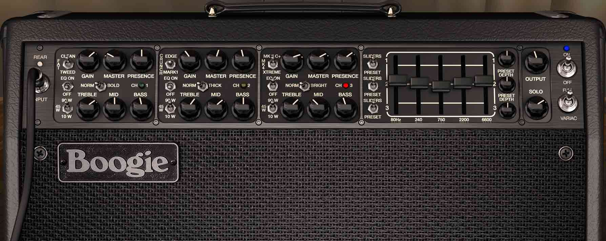   | Mark_V   | MESA/Boogie Mark V™ model.   | Mesa Boogie | このクラシックアンプは、極限のスピードとゲインにおいても、タイトな低音と最速のレスポンスを実現します。スピードメタル、スラッシュメタル、その他のアグレッシブメタルスタイルはもちろん、よりスムースでクリーンなスタイルにも最適です。 | The Mark V is more the one amplifier, it’s nine amplifiers in one. The groundbreaking Mark I™, Mark II™, Mark IIC+, Mark III and Mark IV and more are all available in this unique model recreating the full history of the MESA/Boogie company. Its versatility goes even further with a tube selector to switch between 6L6s and EL34, Diode/Tube and Pentode/Triode rear switches that really lets you explore the full history of distorted guitar tones.  |
| 80  | 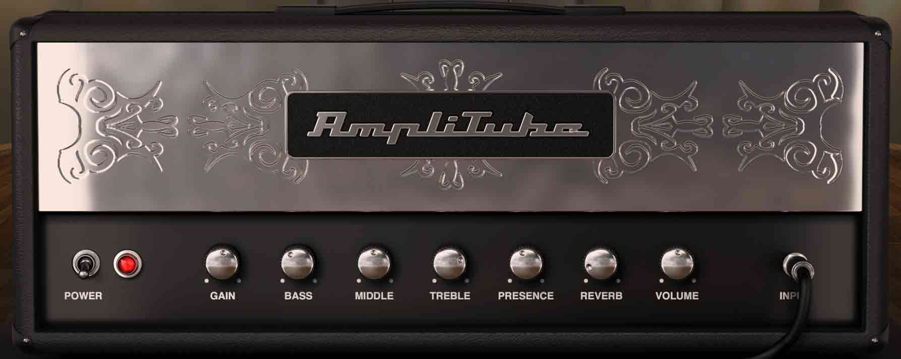 | Metal_Clean_T| Mesa/Boogie® Triple Rectifier™ - Green Channel   | Mesa Boogie | 史上最高のギタリストの一人である彼の厳格な要求に応えるべく設計されたこのアンプは、瞬く間にトーンの純粋主義者とゲインにこだわるファンの間で人気を博しました。史上最もクリーンなトーンから、最もヘビーなトーンまで、幅広いトーンを奏でることができます。| This extremely high quality amplifier delivers a very detailed and clean response on the clean channel, incredibly well defined is the perfect starting point for any kind of sound. Use this channel to get your hyper-driven sounds from stomps only, as well as for creating clean or edgy sounds. Ideal to be driven by overdrive and distortion pedals, the "Green" channel of this iconic amp has been modeled separately.   |
| 81  |    | Metal_Lead_T | Mesa/Boogie® Triple Rectifier™ - Red Channel | Mesa Boogie | 90年代を代表するハードロックミュージシャンの一人によって設計されたこのアンプは、純粋なメタルの狂騒のために作られました。これほどヘヴィでアグレッシブなアンプは、おそらく世界に存在しないでしょう。 | This classic amp delivers the tightest bass and fastest response, even at extreme speeds and gain. The result is perfect for speed, thrash, and other aggressive metal styles as well as smoother, cleaner styles. |
| 82  |    | Modern_Tube_Lead | Mesa/Boogie® Dual Rectifier® | Mesa Boogie | このアメリカン・ベースアンプ・モデルは、オールチューブ・プリアンプとディスクリートMOSFET出力部を備え、真空管とMOSFETテクノロジーの完璧な融合を実現しています。力強いパワーと卓越したトーンで、あらゆるベースを最高のサウンドへと導きます。また、幅広い周波数特性により、ロー・チューニングのベースや5弦ベース、6弦ベースに最適です。  | This amp is a model of one of the leaders in hard, driven rock tones made today. Capable of searing leads and heavy crunch, this amp has been rectified to create a modern rock tone that is hard to beat. |
| 83  | 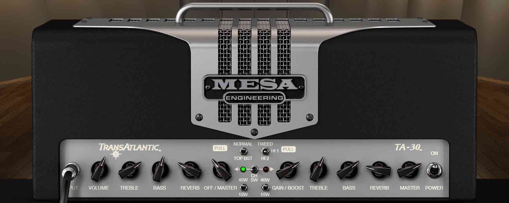 | TransAtlantic_TA-30  | Mesa Boogie® TransAtlantic® TA-30 Combo Model| Mesa Boogie | TransAtlantic TA-30は、英国製アンプへのトリビュートとして、シンプルな操作性と包括的なサウンド・モデリングを融合しています。2チャンネル構成で、5つの異なる「モード」ボイスから選択でき、英国のクラシックな回路だけでなく、アメリカの回路も参考にしています。各チャンネルは3段階の出力レベルを柔軟に調整でき、力強いレスポンスと個性的なサウンドを実現します。ゲインブースト機能と2つのハイゲイン・オプション（チャンネル2はHI 1とHI 2）も備えており、60年代のクラシックなサウンドから、現代​​的で圧倒的なサウンドまで、あらゆるサウンドを網羅するこのモデルの魅力は明らかです。  | A decidedly British tribute of an amplifier, the TransAtlantic TA-30 mixes simplicity of operation with comprehensive sonic sculpting. It sports two-channel operation with 5 distinct “Mode” voice choices that reference not only several classic British circuits but also some American ones as well. Each channel features the flexibility of 3 levels of output power, allowing for powerful response and character. Throw in a Gain Boost feature and 2 high gain options (HI 1 and HI 2 in Channel 2), and it's easy to see why this model covers every sound from the classic '60s to crushing contemporary and everything in between.|
| 84  |    | Triple_Crown | MESA/Boogie Triple Crown™ model. | Mesa Boogie | ロックのハイゲイントーンを追求するTriple Crownは、MESA/Boogieラインの他のどのアンプにも匹敵しない、独自の回路と力強いサウンドで、聴く者を魅了し、圧倒します。躍動感あふれるきらめくクリーンサウンドから、驚くほどタイトでアグレッシブなロックサウンドの壁を揺らすクランチサウンドまで、この新世代アンプ史上最もボーカル豊かで倍音豊かなハイゲインチャンネルを体感してください。| Aimed at rock’s high-gain tones, the Triple Crown can inspire and conquer with its unique circuitry and bold voice, unlike anything else in the MESA/Boogie line. From a bubbly, sparkly clean sound to an amazingly tight and aggressive wall-of-rock crunch, experience one of the most vocal and harmonically rich high-gain channels ever in this new generation amplifier.|
| 85  |    | Triple_Rectifier | Mesa Boogie® Triple Rectifier® Head Model| Mesa Boogie | 最大限のヘッドルームをお求めですか？MESA/Boogie Triple Rectifierは、モダンなハイゲイン・ヘビーギタートーンをはじめとするあらゆるサウンドのスタンダードです。MESA/Boogie Triple Rectifierは、アグレッシブなプレイヤーのために設計されたアグレッシブなアンプです。史上最も多くレコーディングされたアンプの一つであり、そのトーンは世界中の大規模ステージで響き渡っています。1989年の発売以来、最大限のトーンの柔軟性を提供し、グランジ、メタル、その他数え切れ​​ないほどのヘビーなスタイルのサウンドを定義する上で重要な役割を果たしてきました。3チャンネル、8モード動作、様々なレベルのチューブ・サチュレーション、そして事実上切り替え可能なチューブ/ソリッドステート整流器セクションを備えています。| Want maximum headroom? You got it. The MESA/Boogie Triple Rectifier is THE standard for modern high gain heavy guitar tone and more. The MESA/Boogie Triple Rectifier is an aggressive amplifier designed for aggressive players — it's one of the most recorded amplifiers ever made and its tone can be heard rocking big-venue stages all over the world. Originally introduced in 1989, it delivers maximum flexibility of tone and has played a major role in defining the sound of grunge, metal and countless other heavy styles. It delivers 3-channel, 8-mode operation and varying levels of tube saturation as well as a virtually switchable tube/solid state rectifier section.   |
| 86  | 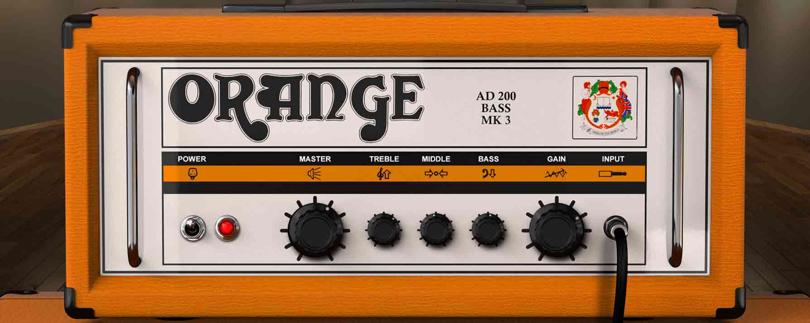   | AD_200   | Orange® AD200B MK 3™ Head Model  | Orange  | AD 200は、まさにこれまで製造された中で最もピュアなベースチューブアンプの一つです。余計な装飾は一切なく、ギターからスピーカーまでの最短の信号経路を実現しています。ヴィンテージサウンドにインスパイアされながらもモダンなトーンを豊富に備えたAD200Bは、クリーミーでダイナミックな低音域と、クランチ感のある中音域を特徴としています。操作はシンプルで、フルEQ、マスターボリューム、ゲインコントロールのみを備えています。| The AD 200 is quite simply one of the purest bass tube amplifiers ever produced. No bells and whistles, just the shortest signal path from your guitar to your speaker. Vintage-inspired, but full of modern tones, the AD200B has a creamy, dynamic low-end with a focused midrange crunch. Simple to use, this amp has only full EQ, master volume, and gain controls.   |
| 87  |  | AD_30| Orange® AD30TC™ Combo Model  | Orange  | AD30TC™は、タイトで弾力があり、素早い特性を持つ、独自のヴィンテージサウンドを備えています。AD30TC™は、30ワットA級真空管アンプの新たな世界標準となる可能性を秘めた最有力候補です。  | With a tight, springy and fast character, the AD30TC™ has its own original vintage sound. The AD30TC™ is the best candidate to be the new world standard for 30-watt Class A valve amplifiers. |
| 88  |  | Dual_Terror  | Orange® Dual Terror™ Head Model  | Orange  | このモデルは、従来のSavageテクノロジーの進化形として設計されたENGL® E650アンプヘッドをベースにしています。アンプの設計は、HI/LOゲインレンジを選択可能な2つの切り替え可能なチャンネルを備え、EQ設定を共有します。さらに、中音域と高音域のレスポンスを微調整するためのコンターとブライトのスイッチも搭載しています。これにより、実質的に4チャンネルアンプとなっています。E650は、きらめくクリーンから骨太なディストーション、リードトーンまで、幅広いトーンを再現できます。ゲインとトーンコントロールを適切に設定することで、様々な中間音やクランチサウンドも生み出せます。| Twin channel 30 watt guitar head. Featuring a unique two stage preamp which has a massive tonal range using just three controls per channel. The Fat Channel delivers warmer tones whilst the Tiny Terror Channel has the sonic character of the original Tiny Terror. |
| 89  |  | OR_50| Orange® OR50H™ Head Model| Orange  | Powerballは、ENGL®ブランドの最もパワフルなモダン・ハイゲイン・アンプの一つをベースにしています。重厚なリズム・トーンと多彩なサウンド・スカルプティング・オプションで高い評価を得ています。Powerballには2つのメイン・チャンネルがあり、各チャンネルには2つの異なるモードが搭載されています。チャンネルIは「クリーン」と「クランチ」、チャンネルIIは「ロー・リード」と「ハイ・リード」です。Powerballは、モダンなスーパー・ハイゲイン・リードからヘビーなクランチ・リズム、そして透き通るようなクリーン・トーンまで、あらゆるサウンドを作り出すパワーと柔軟性を備えています。   | In 1972 Orange launched an amp which came to define the Orange sound; years later it was dubbed the ‘Pics Only’ due the use of pictures and the absence of any text. Although not a reissue, the OR50H owes more than a nod to this vintage legend in its cosmetics, tone and even the construction techniques adopted. Featuring a traditional single channel with a three stage gain section, the real weapon in the OR50's arsenal is the HF Drive control. This is two controls in one! As you turn the control clockwise you will hear the power amp presence increase whilst adding an extra dimension of power amp gain. This is truly one of the most versatile single channel amps ever created.  |
| 90  |    | OR-120   | Orange® OR120™ Head Model| Orange  | このモデルはまさに注目を集める存在です。最初の音から、この英国産のパワーアンプのヴィンテージ・ハンドワイヤード・サウンドと、非常に独創的なサウンドを堪能できます。  | This model can really turn heads. You’ll hear the vintage hand-wired and very original sound of this killer British powerhouse from the first note.|
| 91  | 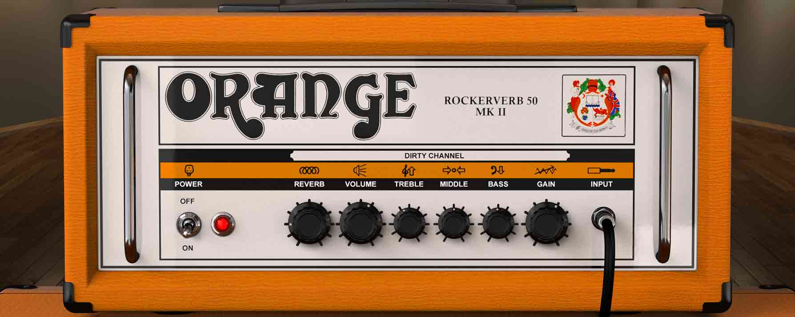 | RockerVerb_50| Orange® RockerVerb 50 MKII™ Head Model   | Orange  | Marshall® JVM410HJSをベースにしたこの多用途4チャンネルアンプは、驚異的なトーンの可能性を提供します。Joe独自の設計にカスタマイズされたこのアンプは、チャンネルごとに3つのモード、独立したノイズフィルター、そして再バイアスされたプレゼンス＆レゾナンスコントロールを備えています。  | Rockerverb is, to say the least, “dirty”, but it is by no means a one trick pony. Start at full gain and and then pull back to experience a variety of classic Orange tones. Whether you’re looking for metal, fusion, blues, rock or even country, the Rockerverb delivers!   |
| 92  |  | Thunderverb_200  | Orange® Thunderverb™ 200 Head Model  | Orange  | このパワフルなアンプには、クリーン/クランチのリードチャンネルが 2 つあり、それぞれ 3 段階のゲインがあります。チャンネル A には、Rockerverb シリーズのリードチャンネルと同じ 3 バンド EQ があります。チャンネル B には、中音域をスクープし、上げていくと低音域と高音域が増加する新しいシェイプのコントロールがあります。このスクープノブを使用して、ビンテージロックからモダンブルース、ハードロックからメタルまで、あらゆる音色を調節できます。この大型ステージトーンヘッドの骨を砕くような低音域のパンチに匹敵するものはありません。静かに使用しているときでも、本格的なパワーを制御できることがわかります。Thunderverb 200 は、ギターアンプの汎用性における新しい標準です。Extended Tonal Range により、この革新的なアンプはベースヘッドとしても使用できます。 | This powerful amplifier sports two clean/crunch lead channels, each with three stages of gain.Channel A has the same 3-band EQ as the lead channel used on the Rockerverb series.Channel B has a new shape control that scoops the mids and increases the bass and treble when turned up. Use this scoop knob to dial in everything from vintage rock to modern blues, hard rock to metal. Nothing can match the bone crushing, bottom-end punch of this big stage tone head.Even when used quietly, you know you are in command of some serious power!The Thunderverb 200 is the new standard for versatility in a guitar amplifier.The Extended Tonal Range enables this revolutionary amplifier to also be used as a bass head. |
| 93  |  | Tiny_Terror  | Orange® Tiny Terror™ Head Model  | Orange  | 英国製、ポイント・ツー・ポイント、オールハンドワイヤードのTiny Terror Hand Wired Editionは、既に伝説的なTiny Terrorをさらに進化させたアンプです。より広い周波数特性により、より力強いサウンドが得られます。Orange Tiny Terrorは、コンパクトな定番モデルです。   | The UK-manufactured point-to-point, all hand wired, Tiny Terror Hand Wired Edition offers a step up from the already legendary Tiny Terror. A wider frequency response gives this amp more bite and punch. The Orange Tiny Terror is a compact classic!|
| 94  | 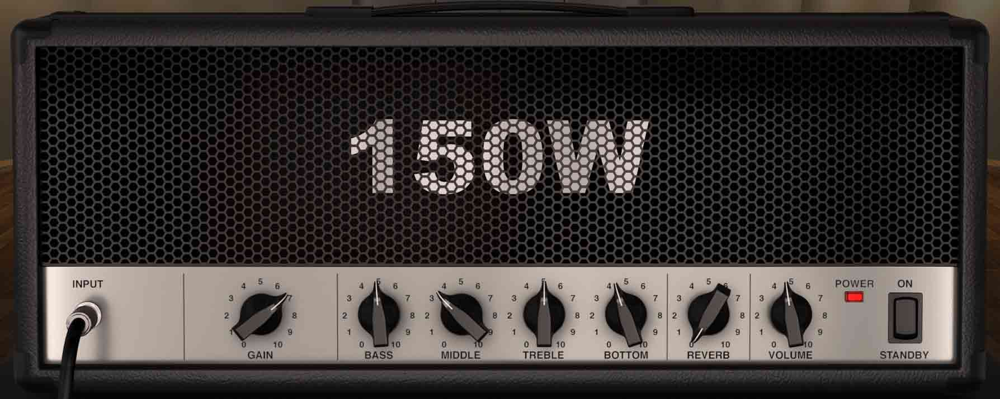   | Metal_Lead_V | Peavey® 5150™ Head   | Peavey  | 現代のダウンチューニングや7弦ギタリストに最適なアンプを目指してゼロから設計。強烈なゲインと力強い低音域は、ロックやメタルのアグレッシブなスタイルに最適です。ソリッドステート・パワーアンプは、歪ませた際にも音の明瞭度を驚くほど高める十分なヘッドルームを確保。プリアンプは、リードギタリストにとって比類のないゲインを備えています。   | Engineered to the exacting demands of one of the greatest guitarists of all time, this amp quickly became a favorite of tone purists and gain heads alike. Capable of some of the cleanest – or the heaviest – tones of all time.  |
| 95  |    | SJ50 | Peavey® 5150™| Peavey  | モダンでアグレッシブでありながら、クラシックアンプのレスポンスを備えた万能なサウンドをお探しなら、このアメリカンモデルが最適です。クリアでキラキラとしたクリーンサウンドと、アグレッシブなオーバードライブサウンドの両方を再現します。| Based on the Peavey® 5150, this legendary amp was originally a signature model for Eddie Van Halen, but its iconic sound became soon the staple tone of many hard rock and heavy metal artists, including Joe Satriani himself.|
| 96  |    | SilverPlate_50   | PRS Archon 50.   | PRS | 正真正銘のクラシックなAmpegチューブサウンド。このオールチューブ・ベースヘッドは、ライブでもスタジオでも、ロックベースサウンドのトレードマークである、温かみがあり、倍音豊かでパンチの効いたサウンドを実現します。SVT-Classicは、まさにロックベースサウンドを生み出したアンプです。スピーカーはSVT-810EまたはSVT-410Hが最適です。   | If you are looking for a modern and aggressive but still versatile sound with the response of a classic amplifier, this American model is the perfect match for your needs. It's able to deliver both clear, sparkling cleans and aggressive overdriven bite.  |
| 97  |  | Darrell_100  | Randall® RG 100  | Randall | 魂、個性、そしてフィーリング。MESA/Boogie Dual Rectifierは、現代のハイゲイン・ヘビーギター・トーンのスタンダードと言えるでしょう。Rectoは、アグレッシブなプレイヤーのために設計されたアグレッシブなアンプです。史上最も多くレコーディングされたアンプの一つであり、そのトーンは世界中の大会場のステージで響き渡っています。1989年の発売以来、トーンの柔軟性を最大限に高め、グランジ、メタル、そして数え切れないほどのヘビーなスタイルのサウンドを定義する上で重要な役割を果たしてきました。3チャンネル、8モードのオペレーション、様々なレベルの真空管サチュレーション、そして事実上切り替え可能な真空管/ソリッドステート整流器セクションを備えています。| Modeled to meticulously mirror the highly coveted Randall® RG 100 ES solid-state, 120 watt amplifier. The sound and tone of this amp became famous when Dimebag Darrell started using it in the early Pantera days.|
| 98  |    | Metal_Lead_W | Randall® Warhead 300™| Randall | EL84を搭載したこのアメリカンモデルは、非常に汎用性が高く、ブルースからヘビーメタルまで、ノブを少し調整するだけで素晴らしいトーンが得られます。オーバードライブからモジュレーションエフェクトまで、ペダルとの相性も抜群で、倍音豊かで響きの良いトーンは、プレイヤーの演奏に驚くほどよく反応します。| Designed by one of the hardest rockers of the '90s, this amp was built for pure metal mayhem. There may be no heavier, more aggressive amp in the world.   |
| 99  |    | Boston_100   | Rockman® X100™   | Rockman | Brit 8000は80年代初頭のJCM800をベースにしています。多くの人がPlexiアンプをMarshallのプッシュ音の決定的なトーンと捉えていますが、実際にはJCM800こそが人々が聴いているアンプなのです。JCM800はPlexiフォーマットから初めて脱却したアンプで、より「ホット」なフロントエンドと、全体的な出力ボリュームのより細かなコントロールを求めるプレイヤーのために設計されました。その結果、コントロール可能なボリュームで、よりプリアンプのオーバードライブとクランチサウンドが強化されました。   | Based on the Tom Scholz Rockman® X100, this early amp sim has long been used in the studio by Joe thanks to its unique take on late '70s rock sound as typified by Boston, with 4 different amp settings and Chorus and Echo effects.  |
| 100 |    | Jazz_Amp_120 | Roland® JC-120™  | Roland  | 1968年以降、ヘンドリックスがほぼ独占的に使用した「あの」アンプ。彼はこのアンプをフルボリュームで鳴らし、複数のヘッドを繋いで巨大で圧倒的なサウンドウォールを作り出すのを好んでいました。この新しいモデルは、IKのDSM™およびSCC™モデリング技術を用いて根本から作り直され、ノーマルチャンネルとトレブルチャンネルの両方に加え、チャンネルブリッジも完全にモデリングされています。 | It may have Jazz in its name, but this versatile clean sound can be heard in many genres. Many of the top metal players keep this not-so-secret weapon in the studio for great clean sounds.   |
| 101 | 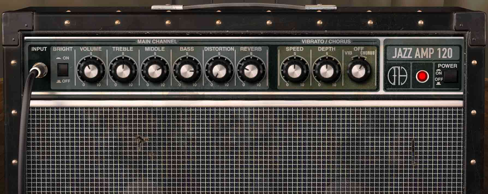   | Jazz_Amp_120_CFH | 1986 Roland® JC-120™ | Roland  | MESA/Boogieラインの中でも最も伝説的なアンプの一つであり、史上最高のメタルレコードの一つにも使用されているこのアンプは、ジョン・ペトルーシのお気に入りであり、彼のカスタムアンプのベースとなったアンプです。クラシックなハイゲイントーンに関しては、Mark IIC+はパーカッシブなキャラクターと、内蔵イコライザーによるサウンドの微調整機能で、その魅力を最大限に引き出します。| Based on the 1986 Roland® JC-120™, this stereo amp was used on the song Cemetery Gates. Fine-tuned to match the exact tone you hear on the Cowboys From Hell album.|
| 102 |    | SilverTwelve | Silvertone® Twin Twelve 1484 | Silvertone  | まさにオールラウンドなハイエンド・ベースアンプです。あらゆるサウンドニーズに応えるフル機能の真空管プリアンプと、タイトなソリッドステート・パワーアンプを融合。SVT-4PROのサウンドスペクトラムは幅広く豊か。極めてニュートラルで透明感のあるサウンドから、力強く個性的なトーンまで、幅広いサウンドを自在に操ることができます。SVT-4PROの設定を自由に試して、自分だけのオリジナルサウンドを作り出せます。| A 60W tube head which Hendrix used in the early part of his career. The amp produces a powerful clean sound, as well as a gritty distortion that has stood the test of time from the psychedelic era through the Grunge period and into today’s modern rock.   |
| 103 | 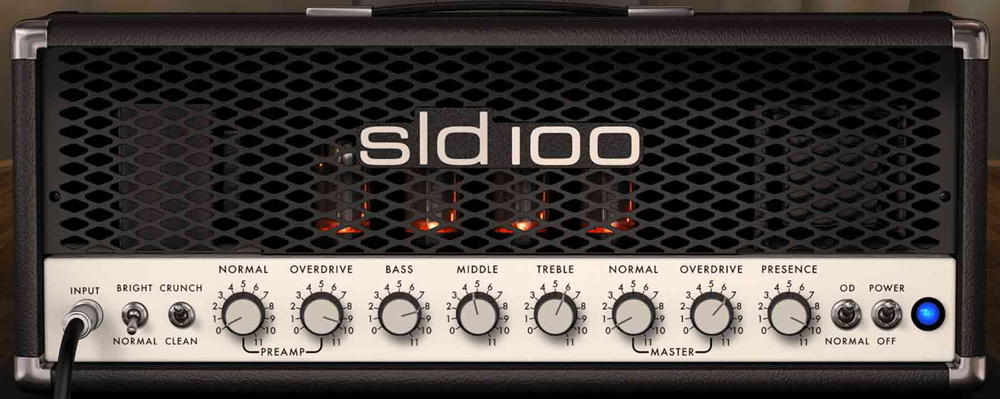 | SLD_100  | Soldano® SLO-100™ Head Model | Soldano | ヘンドリックスがキャリア初期に使用した60Wの真空管ヘッドアンプ。このアンプは、力強いクリーンサウンドと、サイケデリック時代からグランジ時代、そして現代のモダンロックに至るまで、時代を超えて愛されてきたザラザラとした歪みを生み出します。 | The SLD 100 is true icon of high-gain tube distortion tone. The design has remained constant for over 20 years, and it is a hallmark of quality and design. It is often regarded as the finest guitar amp in the world. With the SLD 100 you have separate preamp and master volume controls along with three bands of equalization and a presence control. The SLD 100 uses the finest military grade components and custom designed transformers to put the industry’s finest high-gain guitar tone right in your hands. |
| 104 |    | Tube_Vintage_Combo   | Supro® '50s  | Supro   | ベーシックなデザインながら力強い音色を奏でる、小型のヴィンテージアンプをモデルにしたモデルです。シンプルながらも魅力的なモデルです。 | This is a model of a small vintage amplifier that was basic in design but big in tone. This model is simple but sweet. |
| 105 |    | Bi-Valve | THD® BiValve™ Model  | THD | Tom Scholz Rockman® X100 をベースにしたこの初期のアンプ シミュレーターは、4 つの異なるアンプ設定とコーラスおよびエコー効果を備え、Boston に代表される 70 年代後半のロック サウンドを独自に表現しているため、Joe のスタジオで長年使用されてきました。   | This is a model of the THD® BiValve. This modern boutique amplifier has become very popular on the stage and in the studio. Using a single ended class A design it is capable of wide expanse of tone. From the clean to the crunchy to the heavily saturated, the THD BiValve can create all these tones with ease.   |
| 106 | 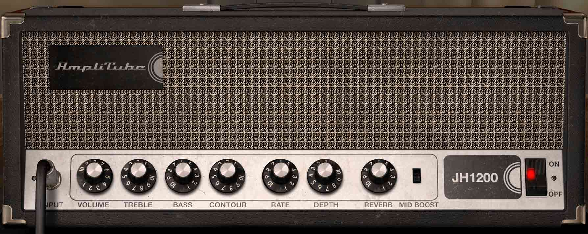 | JH_1200  | the Sunn® 1200S  | the Sunn| Marshall JCM Slashは、Slashが1987年に発表したオリジナルMarshall Silver Jubilee 2555アンプの仕様に基づいて設計されました。これはMarshallがシグネチャーモデルとして初めて製作したアンプでした。 | The JH 1200 is an high-powered tube bass head. Concertgoers at any Hendrix show between 1967 and 1968 would have seen an entire backline consisting of Sunn amps and cabinets. As with many amps from the psychedelic era, the ultra-loud 1200 was popular with both guitarists and bass players.  |
| 107 |  | Green_BA250  | Trace Elliot® AH250™ Head| Trace Elliot| HiAmpは、英国で最も伝説的な真空管アンプの一つをベースにしています。このアンプの豊かで温かみのあるサウンドは、70年代から80年代初頭にかけて、数え切れないほどの音楽制作やパフォーマンスで特徴づけられました。温かみのあるクリーントーンと力強いクランチトーンが高く評価されました。  | With more options than most bass amps, this model gives great flexibility in tone and power. This is a model of a solid state powerhouse bass amplifier with great tone-shaping controls, a warm sound unlike most solid state amps, and a sought-after preamp.|
| 108 |  | BM_30| Brian May’s VOX® AC30™   | VOX | Bassman 300 PROは、温かみのあるオールチューブ・ベーストーンと現代的な柔軟性を兼ね備えています。10バンド・グラフィックEQ、ミッドノッチ・スイッチ（スラップ奏法に最適）、2バンド・スタジオグレードのコンプレッサー、クリーンチャンネルとオーバードライブチャンネルといった機能により、Bassman 300はあらゆるベーシストにとって最適な選択肢となります。  | Based on the classic VOX® AC30™, this model offers the core to match Brian May’s triple way iconic setup.  |
| 109 |  | BM_DK| custom amp by John Deacon| VOX | クラシックな VOX® AC30™ をベースにしたこのモデルは、ブライアン・メイの象徴的なトリプルウェイ・セットアップにマッチするコアを提供します。 | Originally created by John Deacon, after modifying an old radio he found in the garbage. This small amp soon became the trademark sound of many Queen songs.   |
| 110 | 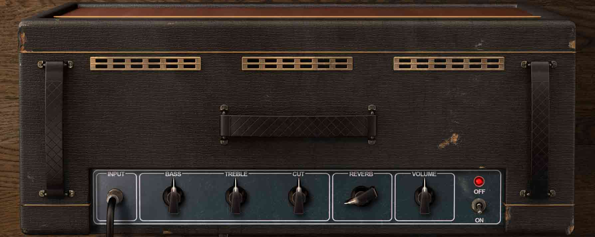   | British_Blue_Tube_30TB   | Vox® AC30™ - Blue Panel  | VOX | この真髄とも言えるアンプで、60年代にタイムスリップしませんか。ただのバージョンではなく、既に素晴らしいアンプの、広く知られ愛されているバージョンを忠実に再現しています。ブリティッシュサウンドをお探しなら、ぜひこのアンプを見つけてください。   | This is a model of a legendary british amplifier which is one of the most widely recognizable and popular amps of all time. Throughout its life, its legendary tone helped to put many of rocks founding fathers (including 4 guys from Liverpool) on the map and has been a highly sought after sound that is still heard on many albums today.   |
| 111 | 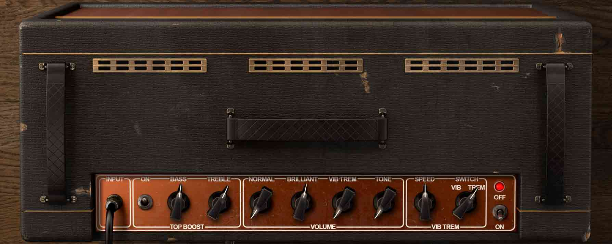 | British_Copper_30TB  | Vox® AC30™ - Copper Panel| VOX | これは、ジミ・ヘンドリックスと一般的に結び付けられる、クラシックな英国製100ワットアンプをモデルにしています。ジミ・ヘンドリックスは、より大きなパワーを得るために複数のアンプヘッド（最大6台）をループ接続することが多かったのですが、AmpliTubeのデュアルリグ機能を使えば、このセットアップを再現できます。   | Take yourself back to the '60s with this quintessential amp. Not just any version, but an accurate model of the well-known and loved version of an already spectacular amplifier. If you want some British sound, you can find it here.|