| No  | source  | Maker  | model  | Based on  | Google翻訳  |
|--|--|--|--|--|--|
| 1|  | Acoustic  | 360Bass_Preamp  | Acoustic® 360™ Bass Preamp  | このアンプは、史上最大かつ大胆なロックバンドの一つで長年にわたりツアーやレコーディングに使用されました。クラシックロックのトーンを自然に奏でるだけでなく、歴史上最も有名なジャズベーシストの一人が使用したことでも知られています。ソリッドステートでありながら、力強く堂々としたサウンドを誇るこのアンプで、容赦なくベースを弾きこなしましょう。 |
| 2| | Aguilar| New_York_B750| Aguilar DB750.  | このアメリカン・ベースアンプ・モデルは、オールチューブ・プリアンプとディスクリートMOSFET出力部を備え、真空管とMOSFETテクノロジーの完璧な融合を実現しています。力強いパワーと卓越したトーンで、あらゆるベースを最高のサウンドへと導きます。また、幅広い周波数特性により、ロー・チューニングのベースや5弦ベース、6弦ベースに最適です。|
| 3| | Ampeg  | SVX-15N| Ampeg® HERITAGE B-15N® Model| Heritage B-15Nは、1964年と1966年の2つのチャンネルを特徴とし、Ampeg独自の柔軟なBaxandall EQと選択可能なバイアスモードにより、究極のトーンコントロールを実現します。厳格な基準に基づいて製造され、世界で最も多く録音されたベーストーンを細部まで忠実に再現します。|
| 4| | Ampeg  | SVX-15R| Ampeg® B-15R® Portaflex “Flip Top” Model| 1960年代のクラシックなベースアンプを、実際の音楽シーンに合わせて強化・改良したモデルです。この限定生産のオールチューブモデルは、Ampegの「クラシック」チューブプリアンプと、60W/100Wの切り替え式チューブパワーアンプを搭載しています。このオプションにより、最も人気の高いヴィンテージベースサウンドが得られます。さらに、紛れもない60年代のトーンを求めるなら、B-15Rキャビネットとの組み合わせがおすすめです。|
| 5|   | Ampeg  | SVX-4B | Ampeg® V-4B® Model | Ampeg V-4B は、オールチューブ 100W の伝説的モデルで、伝説的な 1971 年オリジナルの復刻版です。純粋なチューブ ビンテージ サウンドと、このクラシックにベースの歴史に名を残した紛れもないグラインドを実現します。|
| 6| | Ampeg  | SVX-500| Ampeg® BA500® Model| BA-500は、あらゆる音楽シーンにおいて、力強く繊細なサウンドを実現する、高品位ソリッドステート・ベースアンプです。強力なプリアンプ・サウンド・シェイピング・コントロールにより、あらゆる音楽ジャンルにマッチします。BA-500のキャビネットと相性は抜群ですが、付属のキャビネット・オプションを駆使することで、様々なサウンドをお楽しみいただけます。 |
| 7|   | Ampeg  | SVX-CL | Ampeg® SVT-CLASSIC® Model| 正真正銘のクラシックなAmpegチューブサウンド。このオールチューブ・ベースヘッドは、ライブでもスタジオでも、ロックベースサウンドのトレードマークである、温かみがあり、倍音豊かでパンチの効いたサウンドを実現します。SVT-Classicは、まさにロックベースサウンドを生み出したアンプです。スピーカーはSVT-810EまたはSVT-410Hが最適です。  |
| 8| 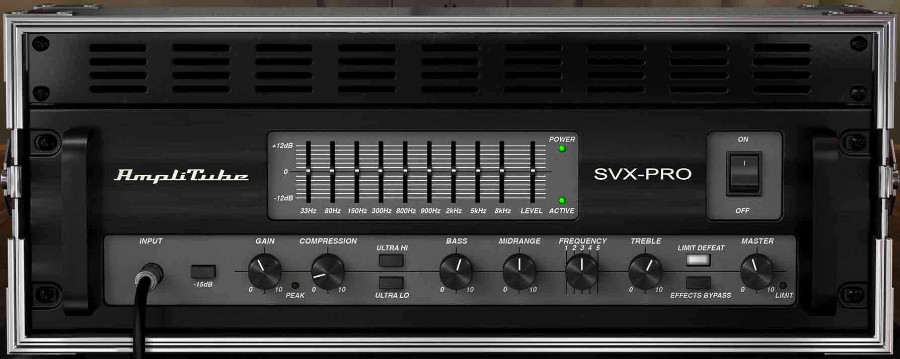| Ampeg  | SVX-PRO| Ampeg® SVT-4PRO® Model| まさにオールラウンドなハイエンド・ベースアンプです。あらゆるサウンドニーズに応えるフル機能の真空管プリアンプと、タイトなソリッドステート・パワーアンプを融合。SVT-4PROのサウンドスペクトラムは幅広く豊か。極めてニュートラルで透明感のあるサウンドから、力強く個性的なトーンまで、幅広いサウンドを自在に操ることができます。SVT-4PROの設定を自由に試して、自分だけのオリジナルサウンドを作り出せます。  |
| 9|   | Ampeg  | SVX-VR | Ampeg® SVT-VR® Model  | Ampeg SVT-VRは、1970年代初頭の「Blue-Line」SVTヘッドのヴィンテージ復刻版です。プリアンプ段、パワーセクション、そしてロッカースイッチに至るまで、オリジナルのロックンロールの主力機種のシグナルパス、トーン、そしてバイブレーションを忠実に再現しています。まさに70年代最高のロックベースアンプの再現と言えるでしょう。  |
| 10  | 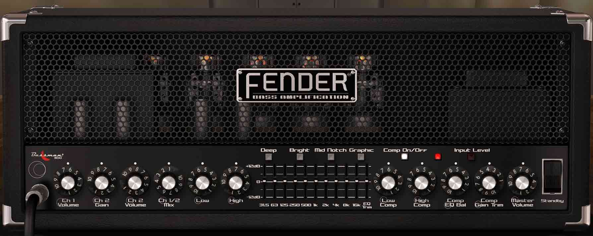 | Bassman| Bassman_300  | Bassman® 300 PRO Model| Bassman 300 PROは、温かみのあるオールチューブ・ベーストーンと現代的な柔軟性を兼ね備えています。10バンド・グラフィックEQ、ミッドノッチ・スイッチ（スラップ奏法に最適）、2バンド・スタジオグレードのコンプレッサー、クリーンチャンネルとオーバードライブチャンネルといった機能により、Bassman 300はあらゆるベーシストにとって最適な選択肢となります。  |
| 11  |   | Bogner | German_34 | Bogner Ecstasy XTC 3534. | ドイツ人クリエイターがブティックサウンドをこのアンプに注ぎ込みました。EL34エンジン搭載のこのアンプは、夢のトーンを極限まで高めるために必要なすべてを備えています。澄み切ったクリーントーンからエッジの効いた激しいディストーションまで、幅広いサウンドを奏でます。クリーントーンのグリーン、お馴染みのオーバードライブ・ブルー、そしてハイゲイン・トーンのレッドの3チャンネルを備えています。|
| 12  |   | Carvin | V3M | Carvin® V3M™ Head Model  | 50ワットのV3Mアンプは、ミュージシャンの夢を叶えるアンプです。圧倒的なパワーと、豊かなリバーブを含む素晴らしいトーンを提供します。V3Mは、最も汎用性の高いアンプの一つです。きらめく高音と深みのある低音を実現する「Pristine Clean」モードを搭載。チャンネルを切り替えれば、深みのあるメタル・クランチや持続的なサスティンが楽しめるクラシック・ロックに。あるいは、チャンネルを切り替えれば、「Soak」コントロールから豊かな倍音が加わり、ジャズやカントリー・ブルースを奏でることもできます。各チャンネルには、「Bright」から「Soak」、そして「Thick」から「Intense」まで、個性的なドライブ・スイッチが搭載されており、EQスイッチでトーンを拡張することも可能です。|
| 13  |   | Diezel | VHandcraft_4 | Diezel VH4| 1992年当時のまま製造されているこのアンプは、ドイツの有名メーカーが初めて開発した象徴的なアンプであり、その肉厚なサウンドは現代音楽のヘビートーンに多大な影響を与えました。その結果、明瞭で厚みのあるサウンドが生まれます。ヘビープレイヤーにとって必携のアンプです。 |
| 14  | 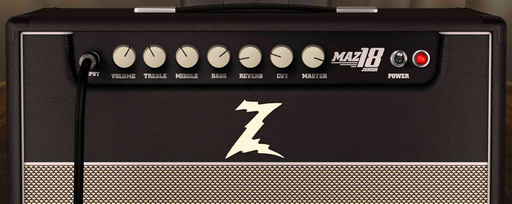  | Dr. Z  | MAZ_18_Jr | Dr. Z® MAZ 18 Jr. Model  | このアンプは、EL84出力管、12AX7および12AT7プリアンプ管、そしてGZ34整流管を搭載し、18Wという定格出力からは想像できないほど力強いサウンドを生み出します。このモデルは、アンプの滑らかなトップエンドとタイトなベースレスポンス、そして素晴らしい3Dリバーブを忠実に再現しています。ハムバッキングピックアップでもシングルコイルピックアップでも、Maz 18 Jr.は明瞭度の高いサウンド、ヘッドルーム、そして特徴的なトーンを提供します。  |
| 15  | | Dr. Z  | Z_Wreck| Dr. Z® Z Wreck Head Model| ロックするほどに鳴り響き、トゥワングするほどの音色、そして驚異的なタッチ感度とキラートーン。この30Wチューブヘッドのボリュームを12以上に上げると、クランチサウンドが鳴り始めます。ボリュームを上げて、その叫び声を聴いてみてください。アンプをクランチに設定し、ギターのボリュームを絞ると、耳障りな音のないクリーントーンが得られます。|
| 16  | 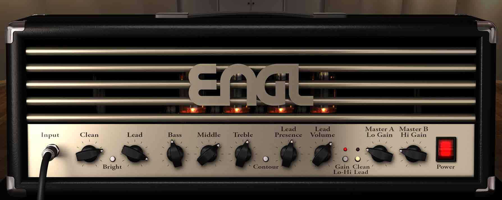| ENGL| E650| ENGL® E650 Head Model | このモデルは、従来のSavageテクノロジーの進化形として設計されたENGL® E650アンプヘッドをベースにしています。アンプの設計は、HI/LOゲインレンジを選択可能な2つの切り替え可能なチャンネルを備え、EQ設定を共有します。さらに、中音域と高音域のレスポンスを微調整するためのコンターとブライトのスイッチも搭載しています。これにより、実質的に4チャンネルアンプとなっています。E650は、きらめくクリーンから骨太なディストーション、リードトーンまで、幅広いトーンを再現できます。ゲインとトーンコントロールを適切に設定することで、様々な中間音やクランチサウンドも生み出せます。 |
| 17  | 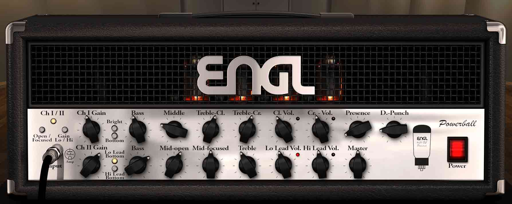  | ENGL| Powerball | ENGL® Powerball Head Model  | Powerballは、ENGL®ブランドの最もパワフルなモダン・ハイゲイン・アンプの一つをベースにしています。重厚なリズム・トーンと多彩なサウンド・スカルプティング・オプションで高い評価を得ています。Powerballには2つのメイン・チャンネルがあり、各チャンネルには2つの異なるモードが搭載されています。チャンネルIは「クリーン」と「クランチ」、チャンネルIIは「ロー・リード」と「ハイ・リード」です。Powerballは、モダンなスーパー・ハイゲイン・リードからヘビーなクランチ・リズム、そして透き通るようなクリーン・トーンまで、あらゆるサウンドを作り出すパワーと柔軟性を備えています。  |
| 18  | | Fender | 53_Bassman| 53 Bassman® Model  | 26ワット、シングル15インチ、オールチューブコンボ。オリジナルのFender Bassmanは、26ワット、1x15インチスピーカーのベースアンプとして誕生し、Fender初のベースアンプとなりました。オリジナルの26ワット、1x15インチモデルは比較的短命で、生産台数はわずか660台でした。このモデルはオリジナルの’53をベースに、そのわずか2年前に発表されたPベースを引き立てるデザインとなっています。また、ヴィンテージモデルの2つのスタイルを切り替えられる「エイジング」スイッチを搭載し、まるでお店で買ったばかりの新品のような新古品のようなサウンドと、使い込まれたヴィンテージのようなサウンドを両立しています。|
| 19  | 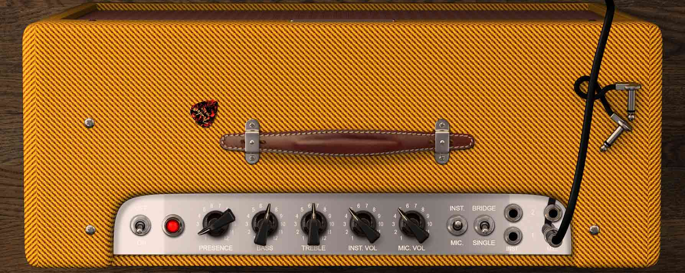| Fender | 57_Bandmaster| 57 Bandmaster™ Model  | 26ワット、3x10インチのオールチューブ・コンボ。3x10のセットアップとハンドワイヤードのオールチューブ構造によるヴィンテージ・ブルース・トーンが特徴のモデルです。「プラグを差し込んですぐに音量を上げる」アンプとして設計されており、そのサウンドは柔軟性が高く、そのバイブが部屋中に広がり、まるで3Dサラウンドサウンドのような印象を与えます。クランチとクリーンは、’57 Customシリーズの他の有名なアンプとは一線を画し、あなたの機材に確かな違いをもたらします。 |
| 20  | 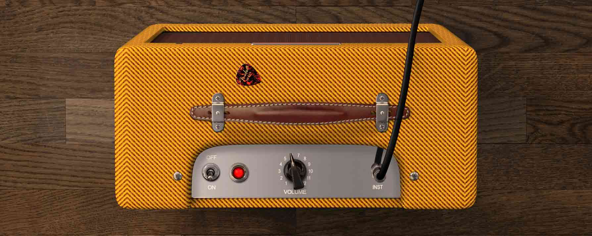 | Fender | 57_Champ  | Fender® '57 Champ® Model | 1950年代後半に登場した、5ワットという低出力から練習にもレコーディングにも重宝される、貴重なコンパクトツイードアンプ。ボリュームを最大にすれば、ギター本体のコントロールを使って、透明感のあるクリーントーンからブルージーなオーバードライブまで、思いのままにトーンを操ることができます。アンプは入力信号に的確に反応します。小型ながらもパワフルな'57 Champは、真のクラシックであり、すべての熱心なギタリストのアンプコレクションに欠かせない存在です。  |
| 21  | 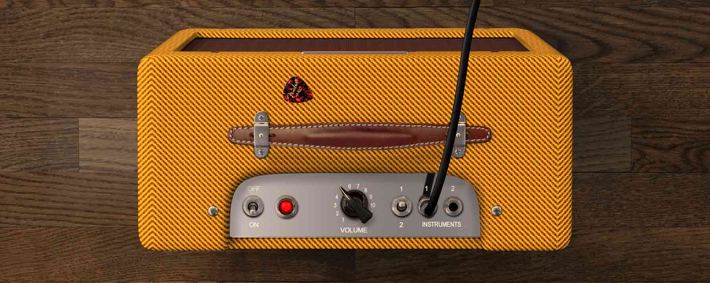  | Fender | 57_Custom_Champ | 57 Custom Champ® Model| 5ワット、8インチシングルのオールチューブコンボアンプ。当時最も多くレコーディングされたアンプと言えるでしょう。'57 Custom Champは、小型のワンノブアンプながら、驚くほど多彩なトーンパレットを提供します。ダイナミックなオーバードライブトーンと、歯切れの良いクラシックなクリーントーンを好む方に最適なアンプです。 |
| 22  | | Fender | 57_Custom_Deluxe| 57 Custom Deluxe™ Model  | 12ワット、12インチシングルのオールチューブコンボ。フェンダーツイードアンプの中でも最も愛されているこのアンプは、きらめくクリーンから力強いクランチまで、あらゆるサウンドを網羅しています。ハンドワイヤードのオールチューブ5E3回路は、あらゆる音量レベルで魔法のようなサウンドを生み出します。Tweed Deluxeは、その圧倒的な存在感と倍音特性から、開発者のお気に入りのトーンでした。このカスタムツイードバージョンは、まるでおとぎ話のようです。外見は美しく、サウンドはまさにモンスターです。|
| 23  |  | Fender | 57_Custom_Pro-Amp  | 57 Custom Pro-Amp Model  | 26ワット、15インチシングルのオールチューブコンボ。’57 Custom Proは、豊かな倍音構成で知られる50年代のオリジナルProをベースにしています。このモデルは、伝説的なフレキシブルでヴィンテージなサウンドを提供します。クリーミーなオーバードライブと滑らかな存在感は、あらゆるヴィンテージトーンに最適で、モダンなサウンドにも抜群の効果を発揮します。15インチシングルスピーカーは、明瞭でありながらわずかにロールオフされた高音域を実現し、ドライブ時の耳障りな音を抑えつつ、ハムバッキングで鳴らした際の低音域のパンチと唸りを維持します。|
| 24  | 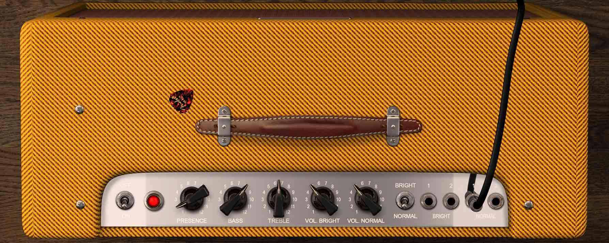  | Fender | 57_Custom_Twin-Amp | 57 Custom Twin-Amp™ Model| 40ワット、2x12インチのオールチューブコンボ。オリジナルの「低出力」40Wツイードアンプは、甘く歌うようなトーンとレスポンスの良いダイナミクスで知られています。’57 Custom Twin-Ampは、ツインアンプならではの、紛れもない豊かさ、透明感、そしてきらめきをプラスした、贅沢なクリーントーンを提供します。強めの音を叩くと、このクラシックモデルは高出力モデルよりも早く立ち上がり、低音域ではスムーズなオーバードライブ・クランチを提供します。滑らかな低音、高音、そして存在感を完璧に再現したこのモデルは、比類のないインタラクションと、驚くほど幅広く多様なサウンドパレットを提供します。 |
| 25  | 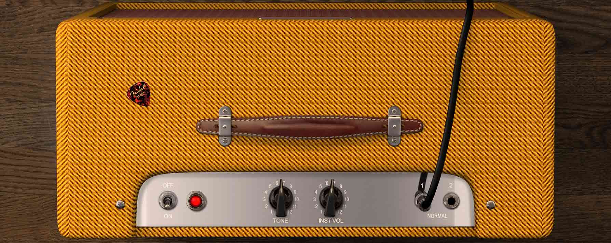  | Fender | 57_Deluxe | 57 Deluxe™ Model| レオ・フェンダーが設計した初期のアンプの一つであり、最も影響力のあるアンプの一つです。Tweed Deluxeは、音量を最大にするとクラシックなコンプレッションのかかったオーバードライブ・トーン、そして低音量では豊かな倍音を持つクリーン・トーンが得られます。Deluxeは、シカゴ・スタイルのブルース・トーン、カントリー、初期のロックンロール・トーンに最適なアンプです。今日では、あらゆるジャンルの現代のプレイヤーが、スタジオでDeluxeを使い、独自の「トーン・マジック」を生み出しています。|
| 26  |  | Fender | 59_Bassman_LTD  | 59 Bassman® LTD Model | おそらく史上最も有名なギターアンプ、ツイードBassman®は、真の音色愛好家にとって必携のアンプです。1950年代、当時発明されたばかりのFender® Precision® Bassギターのアンプとして考案されたこのアンプは、きらめくクリーントーンと、ロックンロールに最適なクランチトーンを生み出すギタリストたちに瞬く間に受け入れられました。このトーンは、60年代以降に活躍したブリティッシュ・スタック・アンプの礎となりました。クリーントーンでもディストーションでも、ロックからブルース、カントリーまで、外部エフェクトの有無を問わず、’59 Bassman®は幅広いジャンルの素晴らしいトーンを生み出す基盤となっています。|
| 27  |   | Fender | 64_Vibroverb | 64 Vibroverb™ Custom Model  | スティーヴィー・レイ・ヴォーンのオリジナルVibroverbをベースに、“アンプ・ドクター”セザール・ディアスがモディファイを施したハンドワイヤード・リイシュー。ブラックフェイス回路と15インチ・スピーカーが生み出す、きらめくクリーントーンは、ジャズやカントリーに最適です。「Mod」モードを選択すれば、プリアンプの真空管ディストーションとパンチの効いた中域が特徴的な、かの有名なテキサス・ブルース・トーンを再現できます。|
| 28  | 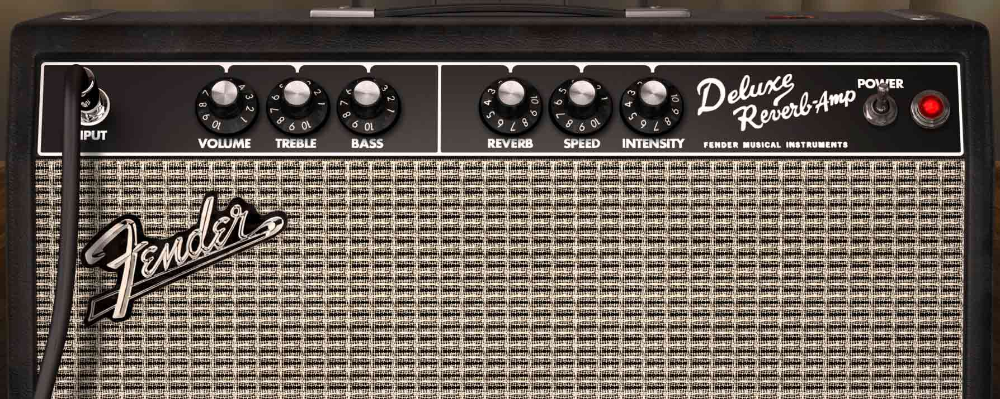| Fender | 65_Deluxe_Reverb| 65 Deluxe Reverb® Model  | ナッシュビルからリバプールまで、クラシックなカントリー＆ロックのトーンを奏でる真のクラシック。デラックス・リバーブは、明るくパンチの効いたアタックが特徴で、フィンガーピッキング、ガレージロックなど、あらゆるジャンルに最適です。ピュアなチューブトーン、優れたリバーブとトレモロ、そして驚くべき汎用性により、数え切れないほどのレコーディングで使用されてきました。  |
| 29  |   | Fender | 65_Princeton | 65 Princeton® Reverb Model  | 最高級の真空管アンプのトーン、自然でダイナミックなクリーントーン、オーバードライブトーン、そして紛れもないフェンダーのスプリングリバーブとチューブビブラートを求めるあなたに、’65 Princeton Reverb Vintage Reissueが登場。1960年代の伝説的モデルPrinceton Reverbは、当初は練習用に設計されていましたが、その力強い真空管サウンドと、スタジオアンプとして愛用した無数のギタリストたちのおかげで、’65 Princeton Reverbはフェンダーアンプの中でも伝説的なコレクターズアイテムの一つとなりました。|
| 30  |   | Fender | 65_Super_Reverb | 65 Super Reverb® Model| 45ワット、4x10インチのオールチューブコンボ。’65 Super Reverbは、トーンの歴史において特別な位置を占め、世界中のプレイヤーの心を掴む、コレクターズアイテムとして欠かせない定番アンプです。きらめくトーンとヴィンテージオーバードライブの快感を備えたこの伝説的なブラックフェイスアンプは、ミディアム出力でステージを埋め尽くすサウンドマシンです。あらゆるスタイルやジャンルのプレイヤーが、このモンスターアンプからレコーディングに最適なトーンを見つけることができるでしょう。Super Reverbは、スプリング駆動による豊かなリバーブと、数え切れないほどのレコードで耳にしたトレモロ回路を備えた、幅広いトーンレンジを備えています。 |
| 31  | 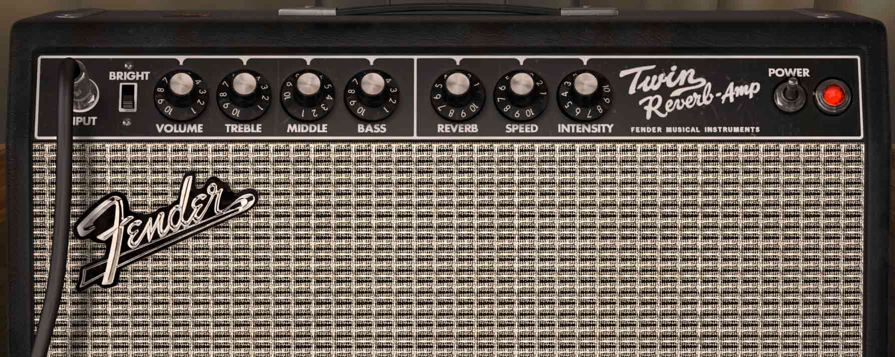 | Fender | 65_Twin_Reverb  | Fender® ’65 Twin Reverb® (Vibrato Channel) Model | 史上最も個性的なアンプの一つ。きらめくピュアなクリーントーンはどんな音楽スタイルにも完璧にマッチしますが、アリーナ級のボリュームでは力強い響きを放ちます。Twin Reverb®は、世界基準のFender®リバーブとトレモロを搭載した、初の人気内蔵エフェクトアンプとして知られています。また、外部ストンプボックスのキャラクターを際立たせるのにも最適なアンプで、非常に汎用性の高いプラットフォームとなっています。|
| 32  | 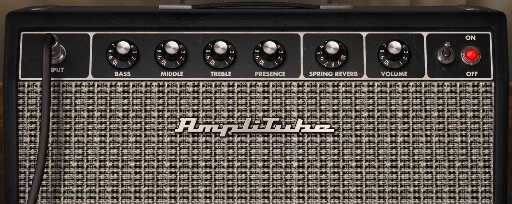  | Fender | American_Tube_Clean_1 | Fender® SuperReverb®  | このアンプは、クラシックなアメリカンギターアンプをモデルにしています。クリーンからダーティーなサウンドまで幅広く対応し、クリーンでクランチなリズム、ロック、カントリー、ブルースなど、音楽の要求に応じてクリーンでありながらダーティーなサウンドも生み出せるアンプが求められるあらゆるジャンルに最適です。  |
| 33  |   | Fender | American_Tube_Clean_2 | Fender® Deluxe Reverb®| このモデルは、もう一つのクラシックなアメリカンアンプを搭載しています。American Tube Clean 1とは異なり、このモデルは小型のコンボアンプです。クリーンでありながら温かみのあるトーンを実現します。|
| 34  | 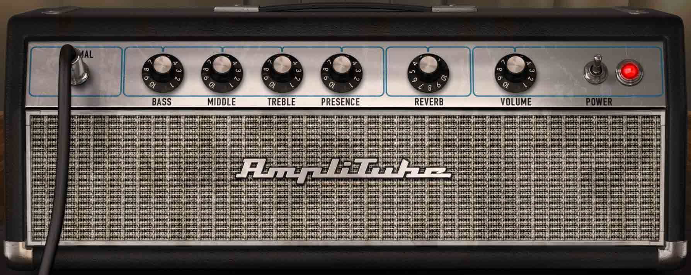  | Fender | American_Tube_Vintage | Fender® Bassman®| このクラシックなアメリカンアンプは、当初はベースアンプとして設計されましたが、後にアメリカンギターアンプの中でも最も人気のあるアンプの一つとなりました。クリーントーンに最適で、様々な音楽ジャンルや演奏スタイルにも幅広く対応します。|
| 35  | 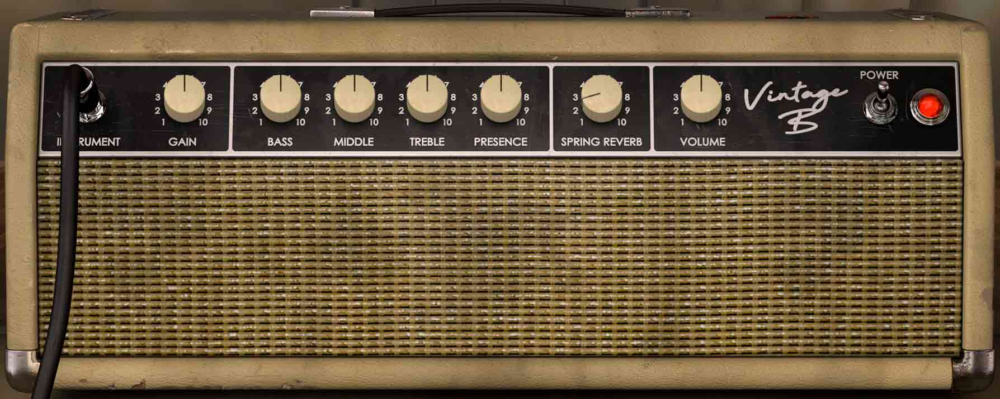  | Fender | American_Vintage_B | Fender® Bassman® Silverface | このアンプのデザインは多くの後継機種に影響を与え、ジミ・ヘンドリックスの「Voodoo Child」のスタジオ録音でも使用されました。|
| 36  | 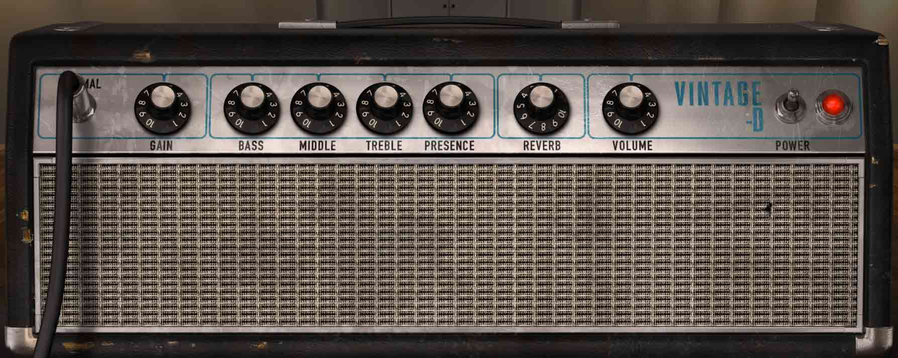  | Fender | American_Vintage_D | Fender® Dual-Showman® | ヘンドリックスはこの100ワットのアンプを1968年に購入し、1968年と1969年のエクスペリエンス・ツアーで、他のアンプと共に使用しました。このアンプにはスプリング・リバーブが内蔵されており、当初は15インチのJ.B. Lansing®スピーカーが2基搭載されていました。 |
| 37  | 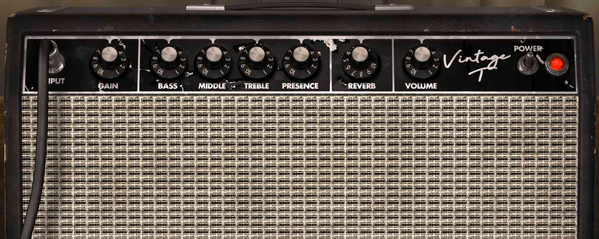  | Fender | American_Vintage_T | Fender® Twin Reverb® Silverface| 1965年から1966年にかけて、ジミ・ヘンドリックスが愛用したアンプです。スプリングリバーブと2基の12インチJ.B. Lansing®スピーカーを搭載していました。 |
| 38  |   | Fender | Champion_600 | Champion™ 600 Model| Champion™ 600は、クラシックなFender®練習用アンプのアップデート版で、オリジナルモデルよりもわずかにゲインが高められています。ボリュームコントロールのみ、パワー管1本のみのクリーンでシンプルな回路、そして低ワット数という特徴的なリードトーンは、数え切れないほどのクラシックロックのレコーディングで使用されてきました。  |
| 39  | | Fender | MH-500_Metalhead| MH-500 Metalhead™ Model  | 現代のダウンチューニングや7弦ギタリストに最適なアンプを目指してゼロから設計。強烈なゲインと力強い低音域は、ロックやメタルのアグレッシブなスタイルに最適です。ソリッドステート・パワーアンプは、歪ませた際にも音の明瞭度を驚くほど高める十分なヘッドルームを確保。プリアンプは、リードギタリストにとって比類のないゲインを備えています。  |
| 40  | | Fender | Pro_Junior| Pro Junior™ Model  | Pro Juniorは、ボリュームとトーンを1つずつコントロールし、低音量ではクラシックなFender®トーン、音量を上げれば力強いビートを生み出すという、他に類を見ない融合を実現しています。タッチセンシティブなオーバードライブ・スタジオトーンを実現する優れたアンプで、世界中のプレイヤーが、プラグインしてボリュームを上げるだけで、シンプルでピュアなブルースやロックの演奏を楽しめるというシンプルな喜びを発見しています。 |
| 41  |  | Fender | Super-Sonic  | Super-Sonic™ Model | クラシックなフェンダー®トーンと現代的な汎用性を融合させたこのアンプは、ヴィンテージ・クリーントーンから70年代スタイルのクラシックロック・クランチ、そしてモダンなメタルやパンクまで、あらゆるサウンドに最適です。独立したカスケード・ゲインステージとカスタムEQにより、ギタリストはヴィンテージからモダンまで、幅広いバリエーションのハードエッジなディストーショントーンを自在に作り出すことができます。しかも、紛れもないフェンダー®のキャラクターはそのままに。 |
| 42  |  | Fender | TBP-1  | TBP-1 Bass Preamp Model  | TBP-1は、フェンダーのパッシブ・トーン・スタック（Twin Reverb®やShowman®などのクラシックな設計に採用）をベースに設計された、真にプロフェッショナルなチューブ・ベース・プリアンプです。クリーミーなチューブ・トーンを実現しながらも、楽器本来の音色を際立たせます。チューブ・オーバードライブ・セクションが「バイト」を加え、Vari-Q™回路がモダンなアクティブ・トーン・シェイピングを実現します。厚みがあり、ナチュラルでバランスの取れたサウンド。TBP-1は、素晴らしいベース・トーンを生み出すための驚異的なデバイスです。 |
| 43  | | Fender | Vibro-King| Vibro-King® Custom Model | このモダンなフェンダー®のクラシックアンプは、驚異的なクリーントーン、比類なきタッチ感度、そしてあらゆるプレイヤーの芸術的インスピレーションを刺激する厚みのあるオーバードライブ特性を備えています。FATスイッチをオンにすると、クラシックなロックディストーションへとブーストされます。Vibro King®はフェンダー®独自の’63リバーブ回路も搭載しており、カントリー、ブルース、サーフといったジャンルのプレイヤーにも最適です。|
| 44  |  | Friedman  | MiniPlex_20  | Friedman Pink Taco PT-20.| EL84を搭載したこのアメリカンモデルは、非常に汎用性が高く、ブルースからヘビーメタルまで、ノブを少し調整するだけで素晴らしいトーンが得られます。オーバードライブからモジュレーションエフェクトまで、ペダルとの相性も抜群で、倍音豊かで響きの良いトーンは、プレイヤーの演奏に驚くほどよく反応します。 |
| 45  |  | Gallien-Krueger | MB_150_S  | Gallien-Krueger® MB150™ Model  | これはダブルベースのための最高のベースコンボです。しかし、その音色はそれだけではありません。エレクトリックベーシストたちは、この小型ながらもパワフルで豊かな音色のコンボアンプを大絶賛しています。素晴らしいものは小型でも存在し、驚くほど大きく豊かなサウンドを生み出します。 |
| 46  |  | Hiwatt | HiAmp  | Hiwatt® DR103™ Amp | HiAmpは、英国で最も伝説的な真空管アンプの一つをベースにしています。このアンプの豊かで温かみのあるサウンドは、70年代から80年代初頭にかけて、数え切れないほどの音楽制作やパフォーマンスで特徴づけられました。温かみのあるクリーントーンと力強いクランチトーンが高く評価されました。 |
| 47  |   | IK Multimedia| Custom_Modern_Hi-Gain | Modern Hi-Gain AmpliTube model | クラシックなAmpliTubeモデルをベースにしたこのアンプは、エッジの効いたディストーションサウンドを生み出す、非常に高いゲインを備えています。モダン・チューブ・リードサウンドに似たサウンドですが、Modern Hi-Gainは、そのサウンドに新たな解釈を加えます。  |
| 48  | 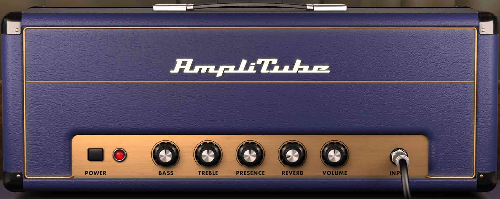 | IK Multimedia| Custom_Solid_State_Fuzz  | Solid State Fuzz AmpliTube model  | AmpliTube 1 のファズ アンプをベースにしたこのモデルは、60 年代のファズ サウンドを彷彿とさせる、非常に独特で歪んだサウンドです。 |
| 50  | 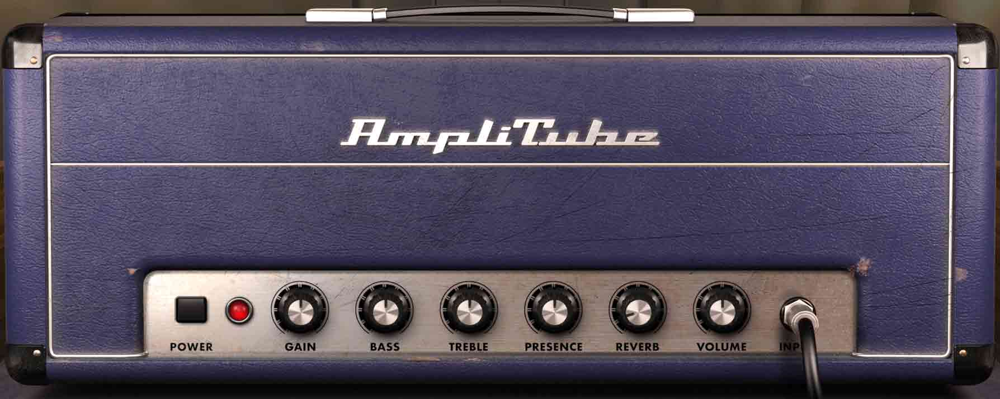 | IK Multimedia| Custom_Solid_State_Lead  | Solid State Lead AmpliTube model  | AmpliTube 1 のファズ アンプをベースにしたこのモデルは、60 年代のファズ サウンドを彷彿とさせる、非常に独特で歪んだサウンドです。 |
| 51  |  | IK Multimedia| Solid_State_Bass_Preamp  | Solid State Bass AmpliTube model  | このモデルは、ソリッドステートのベースプリアンプ、EQ、そしてソリッドステートのパワーアンプモジュールを搭載しています。美しいクリーンサウンドと力強いドライブサウンドを両立しています。  |
| 52  | | Jet City  | JCA100H| Jet City Amplification 333® JCA100H™ Model | ソルダーノのトーンと純粋な真空管パワーを2チャンネル搭載したこのアンプは、大きなステージでの使用に最適です。ノーマルチャンネルは十分なヘッドルームを備え、クリアで明るいクリーントーンを生み出すだけでなく、ハードにドライブすることで荒々しいサウンドも生み出せます。オーバードライブチャンネルは、ソルダーノを有名にした回路をベースにしています。  |
| 53  | 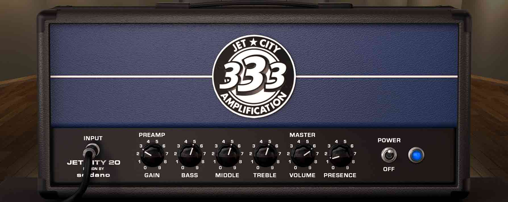  | Jet City  | JCA20H | Jet City Amplification 333® JCA20H™ Model  | ピュアでシンプル、そして真空管サウンドを余すところなく再現するJCA20Hは、オールチューブのシグナルパスを損なうようなギミックや不要な機能は一切排除したシングルチャンネルアンプです。フルEQコントロールとプリアンプとマスターボリュームを独立して搭載し、スパンキーなクリーントーンからクランチーなオーバードライブまで、幅広いトーンを自在に操ります。 |
| 54  |   | Leslie | 122 | Leslie® 122  | まさに定番中の定番。ポップス、ロック、ジャズ、ブルースなど、あらゆるジャンルの音楽にマッチするレスリーサウンドといえば、おそらく122を思い浮かべるでしょう。70年代初頭のビンテージユニットをモデリングしたこのモデルは、122Aと比べてやや温かみのあるサウンドが特徴です。|
| 55  | 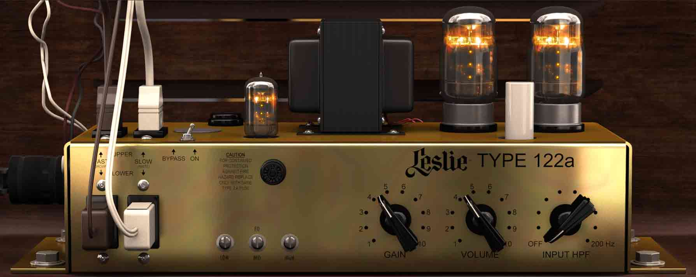| Leslie | 122A| Leslie® 122A | Leslie 122Aは、最も有名なLeslieモデルの現代版です。アンプへのバランス入力と、優れた低音レスポンスを実現するミディアムハイトのキャビネットを備えています。クラシックな122と比べて、より開放的で前面に出る音色が特徴です。|
| 56  |   | Leslie | 147 | Leslie® 147  | Leslie 147は、コネクタが異なり、パワーアンプも若干異なり、アンプへの入力はアンバランスで、キャビネットもやや短い、クラシックなLeslieモデルです。全体的なサウンドはクラシックな122と非常に似ていますが、音楽的に重要な違いがいくつかあります。私たちがモデリングしたのは60年代半ばのビンテージユニットで、ホーンにリフレクターが付いていません。これがサウンドに新たな味わいを与え、クラシックな122とのより明確な音の違いを生み出しています。|
| 57  | 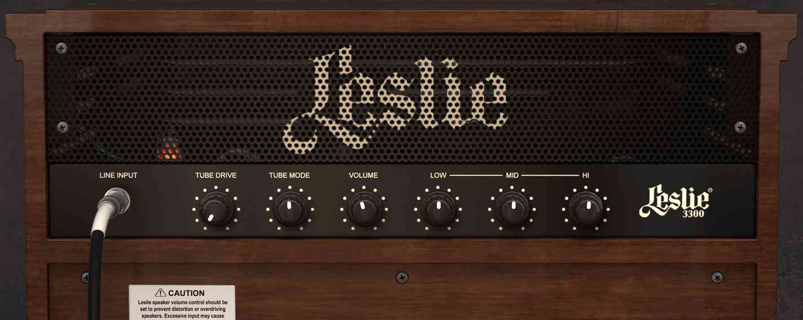 | Leslie | 3300W  | Leslie® 3300 | Leslie 3300wは、300ワットRMSのソリッドステートアンプと本物の真空管プリアンプを搭載した、史上最もパワフルなモデルの一つです。そのサウンドシグネチャーは、ポップ、ロック、ジャズ、ブルースに最適です。  |
| 58  |  | Leslie | G37-St12  | Leslie® G37  | G37は、その紛れもないトーン特性で、あらゆるジャンルのギタリストから高い評価を得ています。内蔵のソリッドステート・ギターアンプと真空管プリアンプ部は、澄み切ったクリーンサウンドから、力強い響きまで、レスリースピーカーならではの多彩なニュアンスを、ギターに最適なヴィンテージ・ボイスのV30 12インチ・スピーカーを搭載したコンパクトなデュアルローター・キャビネットを通して実現します。キーボード奏者向けに、よりポータブルなアンプとして設計されたStudio 12も、真空管駆動のソリッドステートアンプをデュアルローター・キャビネットに搭載し、オルガンの幅広い低音域に合わせて12インチのEminenceベース・スピーカーを搭載しています。  |
| 59  | | Marshall  | AFD_100| Slash-Marshall® AFD100| スラッシュが使用した最もアグレッシブなアンプヘッド。過去30年間で最も重要なロックアルバムの一つ、「アペタイト・フォー・ディストラクション」の伝説的なトーンを再現するデュアルモードアンプ。|
| 60  |   | Marshall  | Brit_8000 | Marshall® JCM800™ head.  | Brit 8000は80年代初頭のJCM800をベースにしています。多くの人がPlexiアンプをMarshallのプッシュ音の決定的なトーンと捉えていますが、実際にはJCM800こそが人々が聴いているアンプなのです。JCM800はPlexiフォーマットから初めて脱却したアンプで、より「ホット」なフロントエンドと、全体的な出力ボリュームのより細かなコントロールを求めるプレイヤーのために設計されました。その結果、コントロール可能なボリュームで、よりプリアンプのオーバードライブとクランチサウンドが強化されました。|
| 61  |   | Marshall  | Brit_9000 | Marshall® JCM900™ head| Brit 9000は、90年代初頭に発表されたJCM800の「進化版」とも言えるJCM900をベースにしています。このデュアルチャンネル・デュアルリバーブヘッドは、チャンネル1はクリーントーンからクランクアップ時の低レベルのリードゲインまで幅広い音作りに対応し、チャンネル2は低ゲイン時には迫力あるリードトーン、高ゲイン時には叫び声のようなソロトーンまで、幅広い音作りを可能にする十分なゲインを備えています。 |
| 62  |  | Marshall  | Brit_Silver  | Marshall® Jubilee™ head  | マーシャル社創立25周年を記念した1987年モデルのMarshall Silver JubileeをベースにしたBrit Silverは、プリアンプ回路にクリーン、リズムクリップ、リードの3つのゲインモードを搭載しています。Silver Jubileeはまた、フルパワーからハーフパワーまで切り替え可能な出力セクションを搭載した初のMarshallモデルでもあり、適度な音量でもJCM800のトーンが得られます。Brit Silverは、オリジナルのSilver Jubileeを細部に至るまで忠実に再現し、真のMarshallトーンを余すところなく再現しています。|
| 63  | 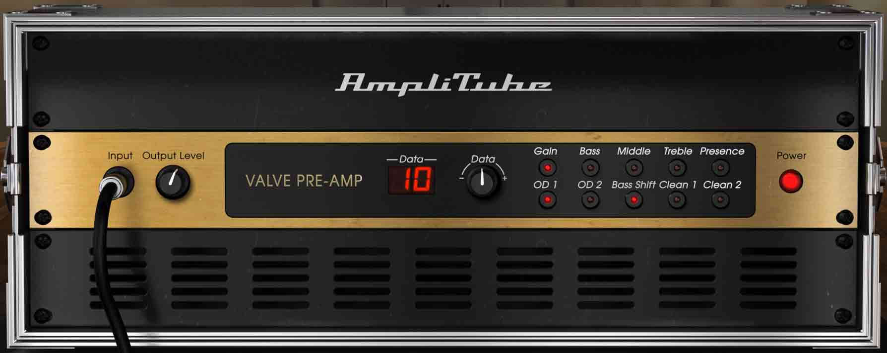 | Marshall  | Brit_Valve_Pre  | Marshall® JMP-1TM tube preamp  | JMP-1は、Marshallが初めてMIDIコントロールの世界に進出したMarshall Toneのモデルです。プレイヤーは思い通りのトーンを作り、そのトーンプリセットを保存して、いつでもMIDIコントロールで呼び出すことができます。JMP-1は最もシンプルで分かりやすいプリアンプの一つです。ボリューム、ゲイン、ベース、ミドル、トレブル、プレゼンスといったMarshallの定番コントロールに加え、ベースシフト、2つのオーバードライブチャンネル、そして2つのクリーンチャンネルも備えています。その使いやすさと「すぐに使える」サウンドキャラクターから、JMP-1は瞬く間に当時を象徴するギタープリアンプの一つとなりました。当時のプロギタリストのほぼ90%が、JMP-1をコレクションに加えていました。 |
| 64  |  | Marshall  | British_Lead_S100  | Marshall® 1959 JTM100™ Super Lead | これは、ジミ・ヘンドリックスと一般的に結び付けられる、クラシックな英国製100ワットアンプをモデルにしています。ジミ・ヘンドリックスは、より大きなパワーを得るために複数のアンプヘッド（最大6台）をループ接続することが多かったのですが、AmpliTubeのデュアルリグ機能を使えば、このセットアップを再現できます。 |
| 65  | 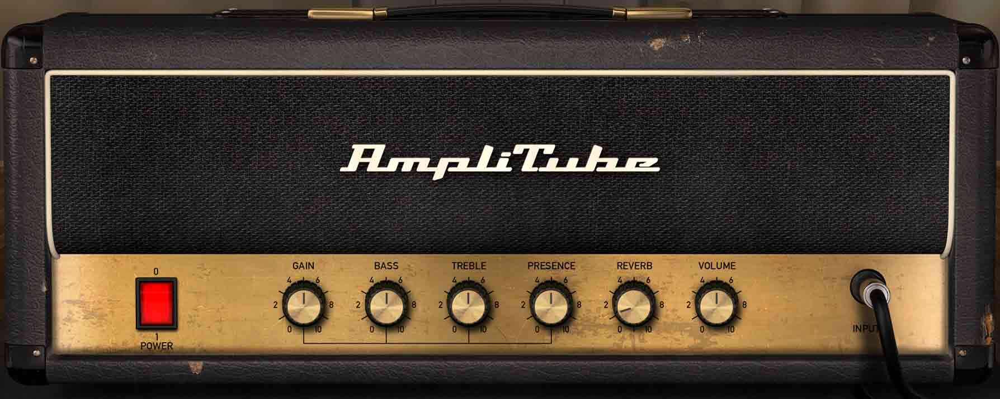| Marshall  | British_Tube_Lead_1| Marshall® JCM800™  | 80年代のハードロックファンに人気を博したこの英国製ギターアンプは、現代の多くのギタリストにとって貴重なトーンであり続けています。真空管アンプならではのサチュレーションサウンドを自在に操るこのモデルは、様々なヘビーロックギターサウンドを生み出す頼れるアンプです。  |
| 66  | 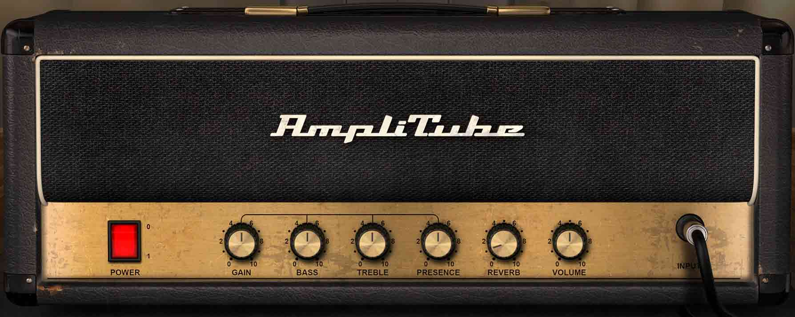| Marshall  | British_Tube_Lead_2| Marshall® JCM900™  | British Tube Lead 1の弟分となるこのモデルは、素晴らしいロックトーン、リードサウンド、そしてヘビーなクランチサウンドを実現できます。よりザラザラとした、ややアグレッシブなサウンドでありながら、このアンプシリーズをロックギター界で広く知られる存在にしたクラシックなトーンは健在です。  |
| 67  | 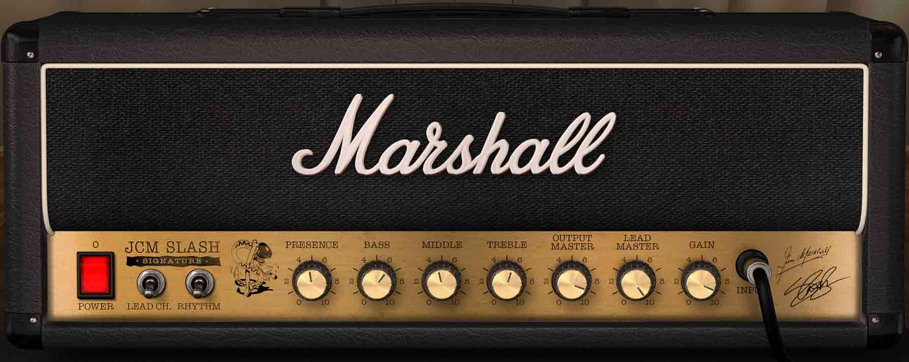  | Marshall  | JCM_Slash | Slash-Marshall® JCM SLASH 2555SL  | Marshall JCM Slashは、Slashが1987年に発表したオリジナルMarshall Silver Jubilee 2555アンプの仕様に基づいて設計されました。これはMarshallがシグネチャーモデルとして初めて製作したアンプでした。 |
| 68  | 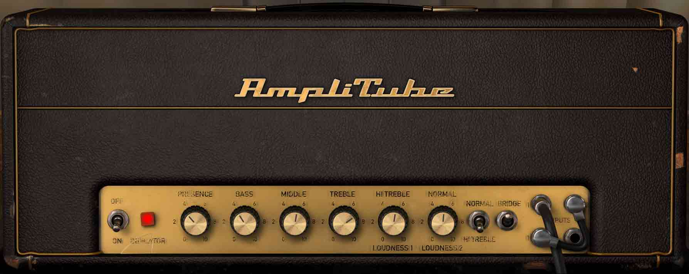| Marshall  | JH_Gold| Marshall® JTM 45™  | 1968年以降、ヘンドリックスがほぼ独占的に使用した「あの」アンプ。彼はこのアンプをフルボリュームで鳴らし、複数のヘッドを繋いで巨大で圧倒的なサウンドウォールを作り出すのを好んでいました。この新しいモデルは、IKのDSM™およびSCC™モデリング技術を用いて根本から作り直され、ノーマルチャンネルとトレブルチャンネルの両方に加え、チャンネルブリッジも完全にモデリングされています。|
| 69  | | Marshall  | Red_Pig| Marshall® MajorTM head| 60年代の逸品であるこのアンプは、リッチー・ブラックモア、ジミー・ペイジ、ジョー・ペリー、そして時にはスティーヴィー・レイ・ヴォーンといったプレイヤーによって有名になったMarshall Major 200「Pig」（愛称）をベースにしています。元々はステージ上の音量をより大きくしたいプレイヤーのために開発され、KT88パワー管を搭載した200ワットの出力を誇りました。大型トランスを搭載するため当時のMarshallよりも3インチも奥行きが深くなっていたことから「The Pig」の愛称で呼ばれ、すぐに大規模な会場で活躍するプレイヤーの間で人気を博しました。  |
| 70  | 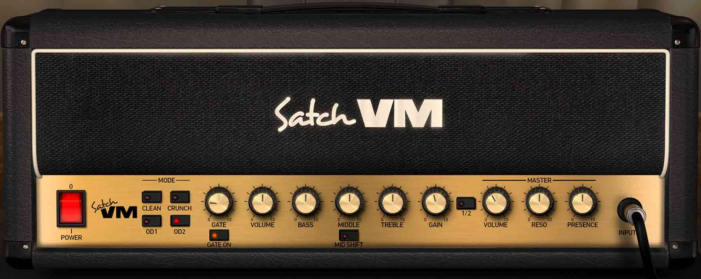 | Marshall  | Satch_VM  | Marshall® JVM410HJS™  | Marshall® JVM410HJSをベースにしたこの多用途4チャンネルアンプは、驚異的なトーンの可能性を提供します。Joe独自の設計にカスタマイズされたこのアンプは、チャンネルごとに3つのモード、独立したノイズフィルター、そして再バイアスされたプレゼンス＆レゾナンスコントロールを備えています。  |
| 71  |   | Marshall  | Vintage_Metal_Lead | Marshall® JMP100™ Head| 70年代の誕生から、オーストラリアのハードロック、80年代のクレイジーなメタル、そしてそれ以降も変わらず愛され続ける、まさに永遠の定番アンプ。これほど長く、これほど激しくロックし続けられるアンプはそう多くありません。 |
| 72  |  | Mesa Boogie  | American_Clean_MKIII  | Mesa/Boogie® MKIII™ Combo - Clean Channel  | 人気と人気を誇るアメリカ製アンプのクリーンチャンネルを再現したモデルです。その特徴的なトーンは、世界中の多くのアルバムやステージで聴くことができます。きらめくクリーンサウンドに加え、ボリュームを上げた際にクランチサウンドも加えた、まさに至高のサウンドを体感してください。 |
| 73  | | Mesa Boogie  | American_Lead_MKIII| Mesa/Boogie® MKIII™ Combo - Lead Channel| これは、クリーンサウンドとリードサウンドの両方で優れたサウンドを生み出すことで知られる、名高い3チャンネル・アメリカンアンプのリードチャンネルです。カリフォルニアのクランチサウンドや、滑らかで味わい深いサスティンリードサウンドを求めるなら、このチャンネルは力強くアグレッシブなサウンドを生み出すことができます。  |
| 74  | 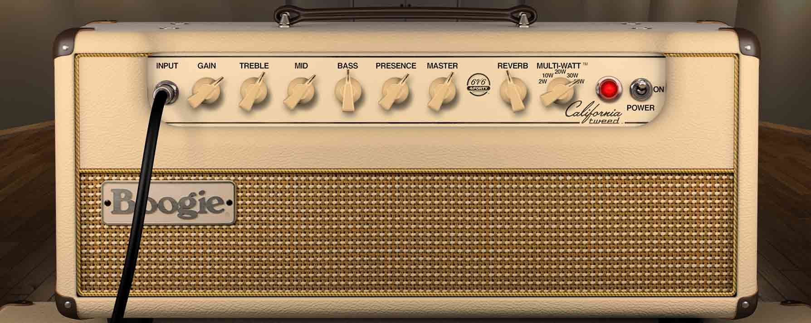| Mesa Boogie  | California_Tweed| MESA/Boogie California Tweed™ model. | California Tweedは、ヴィンテージトーンの新たな境地を切り開くシンプルなデザインです。リバーブを内蔵したシングルチャンネルのシンプルさの中に、オールチューブならではの黄金のトーンが秘められています。マルチワットスイッチにより、2Wから40Wまでの様々な出力オプションから選択でき、このアンプの持つトーンの可能性を最大限に引き出します。 |
| 75  |  | Mesa Boogie  | Dual_Rectifier  | Mesa Boogie® Dual Rectifier® Head Model | 魂、個性、そしてフィーリング。MESA/Boogie Dual Rectifierは、現代のハイゲイン・ヘビーギター・トーンのスタンダードと言えるでしょう。Rectoは、アグレッシブなプレイヤーのために設計されたアグレッシブなアンプです。史上最も多くレコーディングされたアンプの一つであり、そのトーンは世界中の大会場のステージで響き渡っています。1989年の発売以来、トーンの柔軟性を最大限に高め、グランジ、メタル、そして数え切れないほどのヘビーなスタイルのサウンドを定義する上で重要な役割を果たしてきました。3チャンネル、8モードのオペレーション、様々なレベルの真空管サチュレーション、そして事実上切り替え可能な真空管/ソリッドステート整流器セクションを備えています。  |
| 76  | | Mesa Boogie  | Mark_IIC_plus| MESA/Boogie Mark IIC+™ model.  | MESA/Boogieラインの中でも最も伝説的なアンプの一つであり、史上最高のメタルレコードの一つにも使用されているこのアンプは、ジョン・ペトルーシのお気に入りであり、彼のカスタムアンプのベースとなったアンプです。クラシックなハイゲイントーンに関しては、Mark IIC+はパーカッシブなキャラクターと、内蔵イコライザーによるサウンドの微調整機能で、その魅力を最大限に引き出します。  |
| 77  | 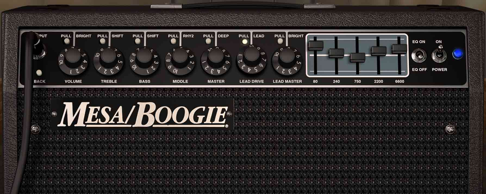 | Mesa Boogie  | Mark_III  | Mesa Boogie® Mark III™ Combo Model| 1984年に発売されたMESA/Boogie Mark IIIは、世界初の3チャンネル「トライモーダル・アンプ」でした。驚異的なサウンド・スカルプティング・オプションに加え、リズム、特徴的な中音域の「クランチ」リズム、そしてリードの3チャンネル構成を誇り、それぞれ独立したゲインとマスターボリューム・コントロールを備えています。ハードウェア版と同様に、豊富なトーンコントロールに加え、極めて重要なBoogie 5バンド・グラフィックEQセクションも搭載しています。|
| 78  | 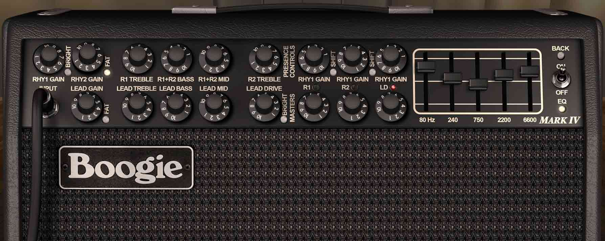| Mesa Boogie  | Mark_IV| Mesa Boogie® Mark IV™ Combo Model | Mesa Engineeringのシグネチャー・ハイゲイン・サウンドを体現するこのアンプは、1990年のクラシックなMark IIIデザインをアップデートしたもので、あの紛れもないBoogieトーンをさらに磨き上げ、サウンドの多様性をさらに高めています。3つのサウンドと個別のコントロール、そして揺るぎないサウンドが、このパワフルなアンプのトーンパレットを決定づけます。3チャンネル構成のアンプは、きらめくクリーンから、倍音とサスティンに富んだ超ハイゲイン・リードサウンドまで、驚くほど幅広いサウンドパレットを提供します。 |
| 79  |   | Mesa Boogie  | Mark_V | MESA/Boogie Mark V™ model.  | Mark Vは単なるアンプではなく、9つのアンプを1台に凝縮したようなアンプです。画期的なMark I™、Mark II™、Mark IIC+、Mark III、Mark IVなど、MESA/Boogieの歴史を全て再現したこのユニークなモデルには、数々のアンプが搭載されています。さらに、6L6とEL34を切り替えられる真空管セレクター、ダイオード/真空管、五極管/三極管を切り替えるリアスイッチなど、その汎用性は格段に向上し、ディストーションギタートーンの歴史を網羅したサウンドを堪能できます。 |
| 80  | | Mesa Boogie  | Metal_Clean_T| Mesa/Boogie® Triple Rectifier™ - Green Channel| この極めて高品質なアンプは、クリーンチャンネルにおいて非常に繊細でクリーンなレスポンスを実現し、驚くほど明瞭なサウンドはあらゆるサウンドの出発点として最適です。このチャンネルは、ストンプペダルだけでハイパードライブサウンドを得るのはもちろん、クリーンサウンドやエッジの効いたサウンドを作るのにも最適です。オーバードライブやディストーションペダルで駆動するのに最適な、この象徴的なアンプの「グリーン」チャンネルは、別途モデリングされています。|
| 81  |   | Mesa Boogie  | Metal_Lead_T | Mesa/Boogie® Triple Rectifier™ - Red Channel  | このクラシックアンプは、極限のスピードとゲインにおいても、タイトな低音と最速のレスポンスを実現します。スピードメタル、スラッシュメタル、その他のアグレッシブメタルスタイルはもちろん、よりスムースでクリーンなスタイルにも最適です。 |
| 82  | | Mesa Boogie  | Modern_Tube_Lead| Mesa/Boogie® Dual Rectifier®| このアンプは、現代のハードでドライブ感のあるロックトーンの先駆者の一つをモデル化したものです。焼けつくようなリードサウンドからヘビーなクランチサウンドまで、他に類を見ないモダンロックトーンを生み出すために改良されています。 |
| 83  | | Mesa Boogie  | TransAtlantic_TA-30| Mesa Boogie® TransAtlantic® TA-30 Combo Model | TransAtlantic TA-30は、英国製アンプへのトリビュートとして、シンプルな操作性と包括的なサウンド・モデリングを融合しています。2チャンネル構成で、5つの異なる「モード」ボイスから選択でき、英国のクラシックな回路だけでなく、アメリカの回路も参考にしています。各チャンネルは3段階の出力レベルを柔軟に調整でき、力強いレスポンスと個性的なサウンドを実現します。ゲインブースト機能と2つのハイゲイン・オプション（チャンネル2はHI 1とHI 2）も備えており、60年代のクラシックなサウンドから、現代​​的で圧倒的なサウンドまで、あらゆるサウンドを網羅するこのモデルの魅力は明らかです。 |
| 84  | 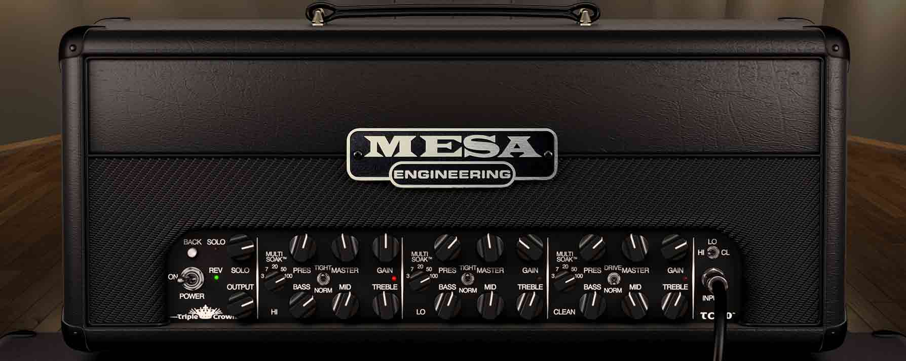  | Mesa Boogie  | Triple_Crown | MESA/Boogie Triple Crown™ model.  | ロックのハイゲイントーンを追求するTriple Crownは、MESA/Boogieラインの他のどのアンプにも匹敵しない、独自の回路と力強いサウンドで、聴く者を魅了し、圧倒します。躍動感あふれるきらめくクリーンサウンドから、驚くほどタイトでアグレッシブなロックサウンドの壁を揺らすクランチサウンドまで、この新世代アンプ史上最もボーカル豊かで倍音豊かなハイゲインチャンネルを体感してください。 |
| 85  | | Mesa Boogie  | Triple_Rectifier| Mesa Boogie® Triple Rectifier® Head Model  | 最大限のヘッドルームをお求めですか？MESA/Boogie Triple Rectifierは、モダンなハイゲイン・ヘビーギタートーンをはじめとするあらゆるサウンドのスタンダードです。MESA/Boogie Triple Rectifierは、アグレッシブなプレイヤーのために設計されたアグレッシブなアンプです。史上最も多くレコーディングされたアンプの一つであり、そのトーンは世界中の大規模ステージで響き渡っています。1989年の発売以来、最大限のトーンの柔軟性を提供し、グランジ、メタル、その他数え切れ​​ないほどのヘビーなスタイルのサウンドを定義する上で重要な役割を果たしてきました。3チャンネル、8モード動作、様々なレベルのチューブ・サチュレーション、そして事実上切り替え可能なチューブ/ソリッドステート整流器セクションを備えています。  |
| 86  |   | Orange | AD_200 | Orange® AD200B MK 3™ Head Model| AD 200は、まさにこれまで製造された中で最もピュアなベースチューブアンプの一つです。余計な装飾は一切なく、ギターからスピーカーまでの最短の信号経路を実現しています。ヴィンテージサウンドにインスパイアされながらもモダンなトーンを豊富に備えたAD200Bは、クリーミーでダイナミックな低音域と、クランチ感のある中音域を特徴としています。操作はシンプルで、フルEQ、マスターボリューム、ゲインコントロールのみを備えています。|
| 87  | 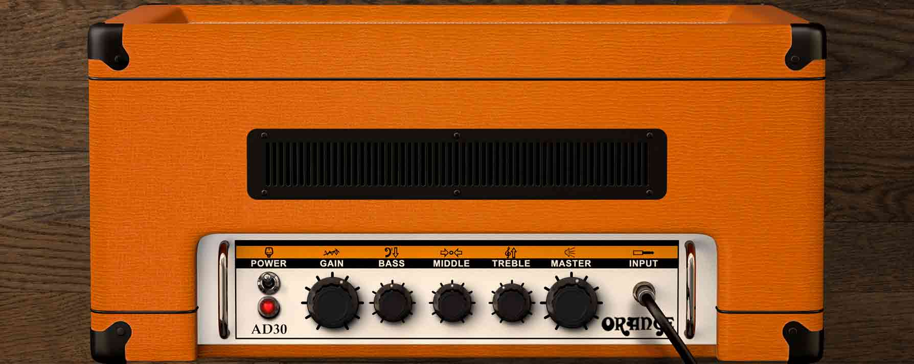 | Orange | AD_30  | Orange® AD30TC™ Combo Model | AD30TC™は、タイトで弾力があり、素早い特性を持つ、独自のヴィンテージサウンドを備えています。AD30TC™は、30ワットA級真空管アンプの新たな世界標準となる可能性を秘めた最有力候補です。|
| 88  |  | Orange | Dual_Terror  | Orange® Dual Terror™ Head Model| ツインチャンネル30ワットギターヘッド。チャンネルごとにわずか3つのコントロールで、幅広いトーンレンジを実現する独自の2ステージプリアンプを搭載。Fatチャンネルはより温かみのあるトーンを、Tiny TerrorチャンネルはオリジナルのTiny Terrorのサウンド特性を継承しています。|
| 89  | 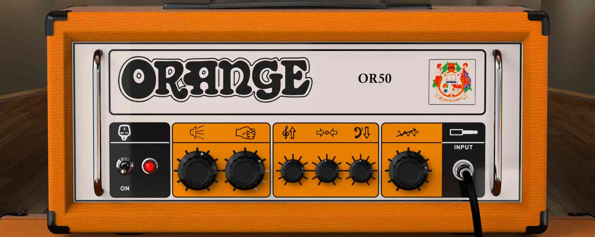 | Orange | OR_50  | Orange® OR50H™ Head Model| 1972年、OrangeはOrangeサウンドを定義することになるアンプを発売しました。数年後、写真のみを使用し、テキストを一切使用しなかったことから「Pics Only（写真のみ）」というあだ名が付けられました。復刻版ではありませんが、OR50Hは、その外観、トーン、そして採用された構造技術に至るまで、このヴィンテージの伝説的なアンプに敬意を表して作られています。伝統的なシングルチャンネルに3段階のゲインセクションを備えたOR50の真の武器は、HF Driveコントロールです。これは2つのコントロールを1つにまとめたものです。コントロールを時計回りに回すと、パワーアンプの存在感が増し、パワーアンプのゲインに新たな次元が加わります。これは、これまでで最も汎用性の高いシングルチャンネルアンプの一つと言えるでしょう。|
| 90  |   | Orange | OR-120 | Orange® OR120™ Head Model| このモデルはまさに注目を集める存在です。最初の音から、この英国産のパワーアンプのヴィンテージ・ハンドワイヤード・サウンドと、非常に独創的なサウンドを堪能できます。 |
| 91  | | Orange | RockerVerb_50| Orange® RockerVerb 50 MKII™ Head Model  | Rockerverbは、控えめに言っても「ダーティー」ですが、決して一つの技に特化しているわけではありません。まずはフルゲインから始めて、徐々にゲインを下げていくことで、Orangeのクラシックなトーンを幅広く体験できます。メタル、フュージョン、ブルース、ロック、さらにはカントリーなど、どんなジャンルでもRockerverbが期待に応えます。|
| 92  | 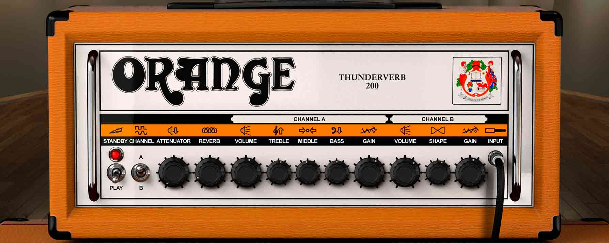  | Orange | Thunderverb_200 | Orange® Thunderverb™ 200 Head Model  | このパワフルなアンプには、クリーン/クランチのリードチャンネルが 2 つあり、それぞれ 3 段階のゲインがあります。チャンネル A には、Rockerverb シリーズのリードチャンネルと同じ 3 バンド EQ があります。チャンネル B には、中音域をスクープし、上げていくと低音域と高音域が増加する新しいシェイプのコントロールがあります。このスクープノブを使用して、ビンテージロックからモダンブルース、ハードロックからメタルまで、あらゆる音色を調節できます。この大型ステージトーンヘッドの骨を砕くような低音域のパンチに匹敵するものはありません。静かに使用しているときでも、本格的なパワーを制御できることがわかります。Thunderverb 200 は、ギターアンプの汎用性における新しい標準です。Extended Tonal Range により、この革新的なアンプはベースヘッドとしても使用できます。 |
| 93  | 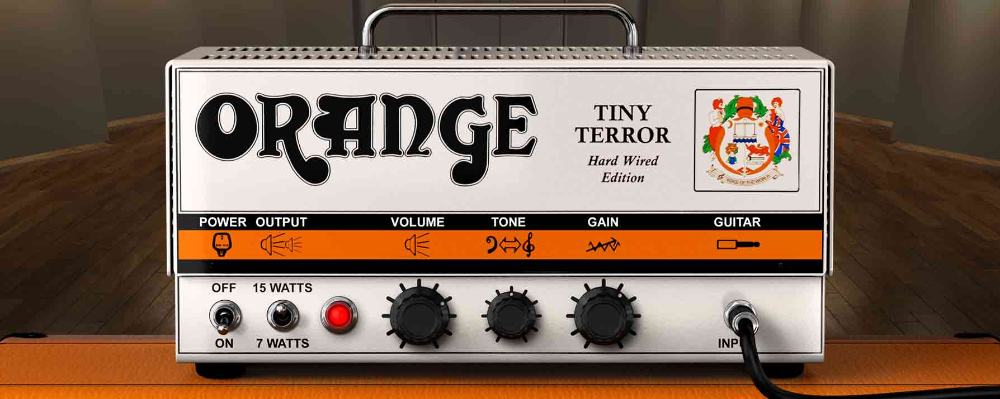 | Orange | Tiny_Terror  | Orange® Tiny Terror™ Head Model| 英国製、ポイント・ツー・ポイント、オールハンドワイヤードのTiny Terror Hand Wired Editionは、既に伝説的なTiny Terrorをさらに進化させたアンプです。より広い周波数特性により、より力強いサウンドが得られます。Orange Tiny Terrorは、コンパクトな定番モデルです。 |
| 94  |   | Peavey | Metal_Lead_V | Peavey® 5150™ Head | 史上最高のギタリストの一人である彼の厳格な要求に応えるべく設計されたこのアンプは、瞬く間にトーンの純粋主義者とゲインにこだわるファンの間で人気を博しました。史上最もクリーンなトーンから、最もヘビーなトーンまで、幅広いトーンを奏でることができます。 |
| 95  | 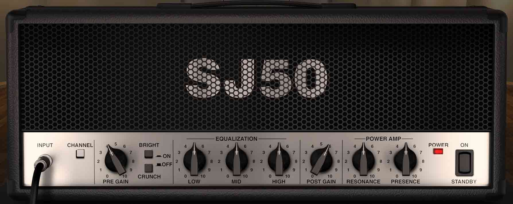| Peavey | SJ50| Peavey® 5150™| Peavey® 5150 をベースにしたこの伝説的なアンプは、もともとエディ・ヴァン・ヘイレンのシグネチャーモデルでしたが、その象徴的なサウンドはすぐにジョー・サトリアーニ自身を含む多くのハードロックやヘビーメタルのアーティストの定番トーンとなりました。|
| 96  | 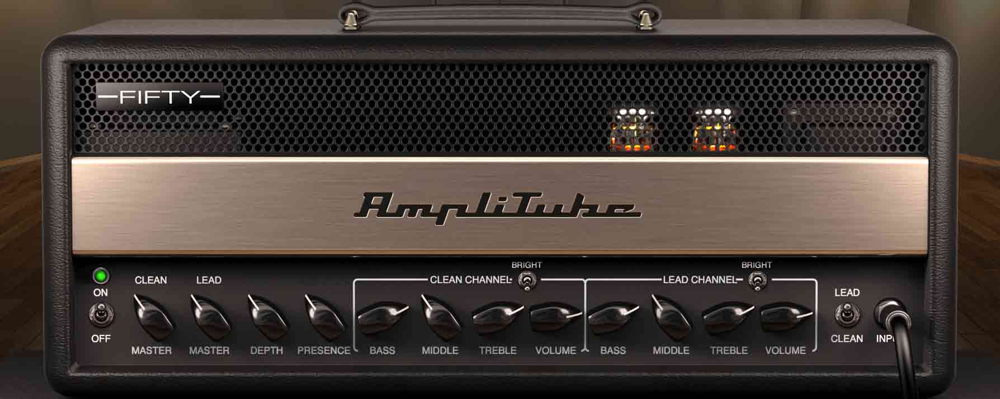 | PRS | SilverPlate_50  | PRS Archon 50.  | モダンでアグレッシブでありながら、クラシックアンプのレスポンスを備えた万能なサウンドをお探しなら、このアメリカンモデルが最適です。クリアでキラキラとしたクリーンサウンドと、アグレッシブなオーバードライブサウンドの両方を再現します。|
| 97  | 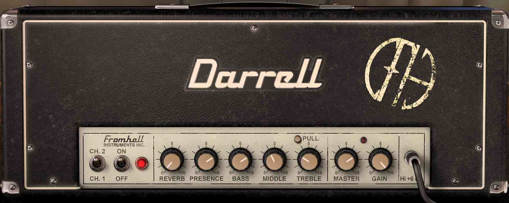 | Randall| Darrell_100  | Randall® RG 100 | 非常に人気の高いRandall® RG 100 ESソリッドステート120ワットアンプを忠実に再現。このアンプのサウンドとトーンは、パンテラ初期のダイムバッグ・ダレルが使用し始めたことで有名になりました。 |
| 98  | 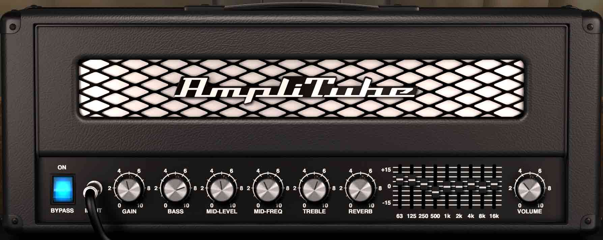  | Randall| Metal_Lead_W | Randall® Warhead 300™ | 90年代を代表するハードロックミュージシャンの一人によって設計されたこのアンプは、純粋なメタルの狂騒のために作られました。これほどヘヴィでアグレッシブなアンプは、おそらく世界に存在しないでしょう。  |
| 99  | | Rockman| Boston_100| Rockman® X100™  | Tom Scholz Rockman® X100 をベースにしたこの初期のアンプ シミュレーターは、4 つの異なるアンプ設定とコーラスおよびエコー効果を備え、Boston に代表される 70 年代後半のロック サウンドを独自に表現しているため、Joe のスタジオで長年使用されてきました。 |
| 100 |   | Roland | Jazz_Amp_120 | Roland® JC-120™ | 名前に「ジャズ」と付いていますが、この万能なクリーンサウンドは様々なジャンルで聴くことができます。多くのトップメタルプレイヤーが、素晴らしいクリーンサウンドを生み出すために、この秘密兵器をスタジオに常備しています。  |
| 101 | | Roland | Jazz_Amp_120_CFH| 1986 Roland® JC-120™  | 1986年製Roland® JC-120™をベースにしたこのステレオアンプは、「Cemetery Gates」で使用されました。アルバム「Cowboys From Hell」で聴けるトーンと全く同じになるよう微調整されています。 |
| 102 |   | Silvertone| SilverTwelve | Silvertone® Twin Twelve 1484| ヘンドリックスがキャリア初期に使用した60Wの真空管ヘッドアンプ。このアンプは、力強いクリーンサウンドと、サイケデリック時代からグランジ時代、そして現代のモダンロックに至るまで、時代を超えて愛されてきたザラザラとした歪みを生み出します。|
| 103 | | Soldano| SLD_100| Soldano® SLO-100™ Head Model| SLD 100は、ハイゲイン・チューブ・ディストーション・トーンの真のアイコンです。20年以上もの間、そのデザインは変わらず受け継がれ、品質とデザインの象徴となっています。世界最高峰のギターアンプと称されることも少なくありません。SLD 100は、プリアンプとマスターボリュームを独立してコントロールできるほか、3バンドのイコライザーとプレゼンス・コントロールも搭載しています。最高級のミリタリーグレードのコンポーネントとカスタム設計のトランスフォーマーを採用し、業界最高峰のハイゲイン・ギター・トーンをあなたの手にお届けします。|
| 104 | 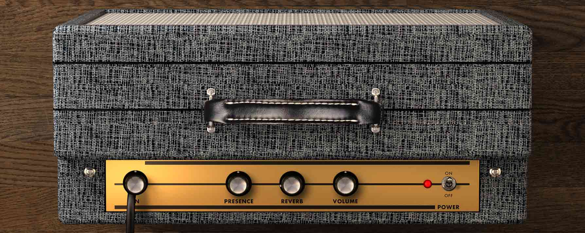  | Supro  | Tube_Vintage_Combo | Supro® '50s  | ベーシックなデザインながら力強い音色を奏でる、小型のヴィンテージアンプをモデルにしたモデルです。シンプルながらも魅力的なモデルです。 |
| 105 | 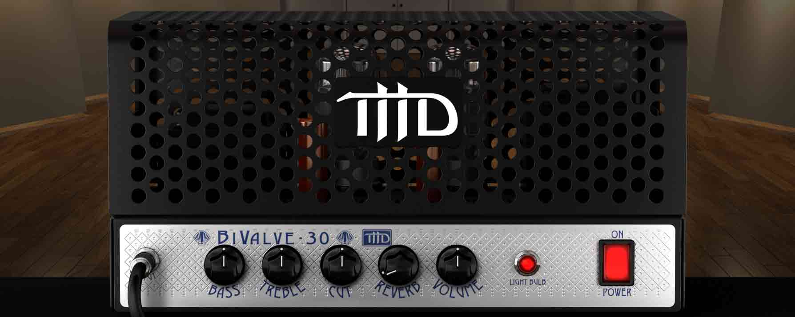 | THD | Bi-Valve  | THD® BiValve™ Model| これはTHD® BiValveのモデルです。このモダンなブティックアンプは、ステージでもスタジオでも非常に人気があります。シングルエンドのクラスA設計を採用し、幅広いトーンを表現できます。クリーンからクランチー、そして重厚なサチュレーションまで、THD BiValveはあらゆるトーンを簡単に作り出すことができます。  |
| 106 | | the Sunn  | JH_1200| the Sunn® 1200S | JH 1200は高出力の真空管ベースヘッドです。1967年から1968年にかけて行われたヘンドリックスのコンサートでは、バックライン全体がSunnのアンプとキャビネットで埋め尽くされていたことがよくありました。サイケデリック時代の多くのアンプと同様に、超大音量の1200はギタリストとベーシストの両方に人気を博しました。|
| 107 |  | Trace Elliot | Green_BA250  | Trace Elliot® AH250™ Head| 他のベースアンプよりも豊富なオプションを備えたこのモデルは、トーンとパワーにおいて優れた柔軟性を提供します。優れたトーンシェイピングコントロール、他のソリッドステートアンプにはない温かみのあるサウンド、そして人気のプリアンプを備えた、ソリッドステートのパワフルなベースアンプのモデルです。 |
| 108 | 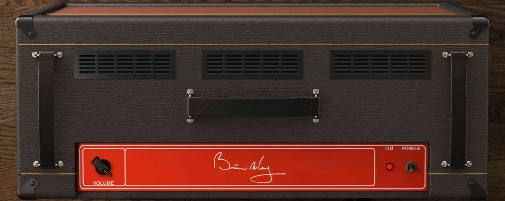 | VOX | BM_30  | Brian May’s VOX® AC30™| クラシックな VOX® AC30™ をベースにしたこのモデルは、ブライアン・メイの象徴的なトリプルウェイ・セットアップにマッチするコアを提供します。  |
| 109 | 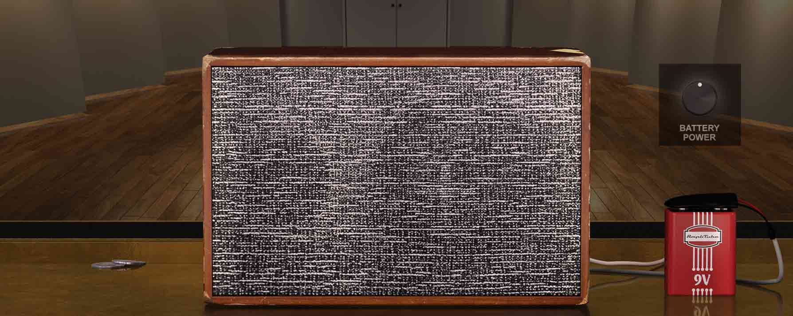 | VOX | BM_DK  | custom amp by John Deacon| ジョン・ディーコンがゴミ捨て場で見つけた古いラジオを改造して作ったこの小型アンプは、すぐにクイーンの楽曲のトレードマークとなるサウンドとなりました。  |
| 110 | | VOX | British_Blue_Tube_30TB| Vox® AC30™ - Blue Panel  | これは、伝説的な英国製アンプのモデルです。このアンプは、史上最も広く知られ、人気のあるアンプの一つです。その伝説的なトーンは、その生涯を通じて、多くのロックの創始者（リバプール出身の4人を含む）の名を世に知らしめ、今日でも多くのアルバムで聴くことができる、非常に人気のあるサウンドとなっています。|
| 111 | | VOX | British_Copper_30TB| Vox® AC30™ - Copper Panel| この真髄とも言えるアンプで、60年代にタイムスリップしませんか。ただのバージョンではなく、既に素晴らしいアンプの、広く知られ愛されているバージョンを忠実に再現しています。ブリティッシュサウンドをお探しなら、ぜひこのアンプを見つけてください。 |

