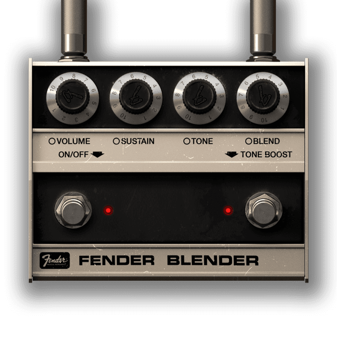
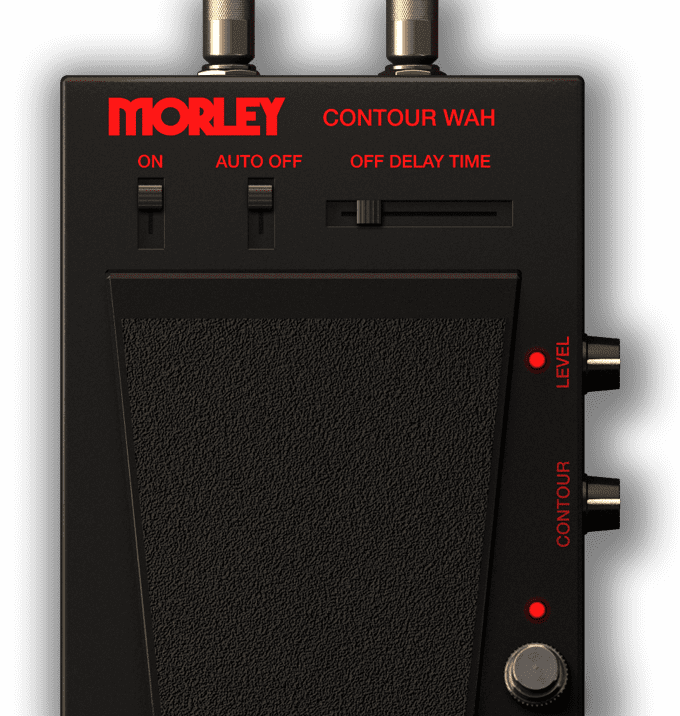
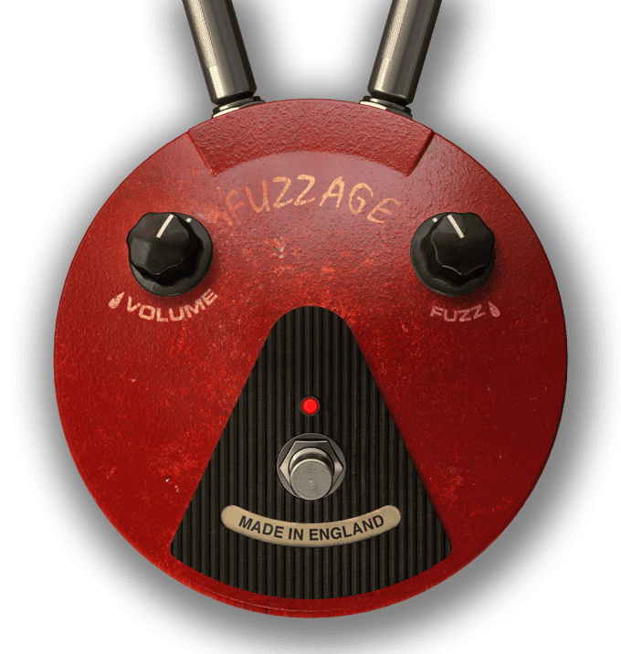
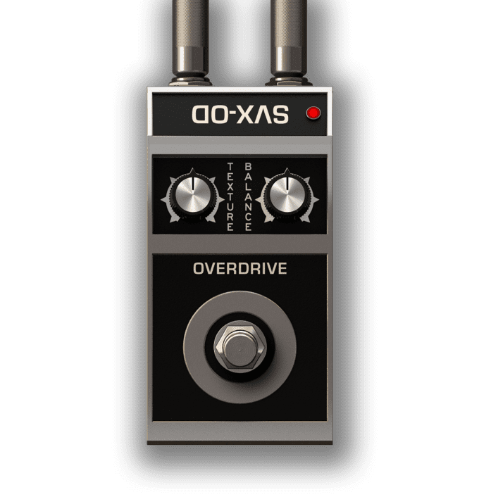

| No  | PNG                                  | source                                                                                                   |
|-----|--------------------------------------|----------------------------------------------------------------------------------------------------------|
| 1   | at5_stomp_10_Band_Graphic@2x.png     |          |
| 2   | at5_stomp_63_Reverb@2x.png           |                      |
| 3   | at5_stomp_6_Band_EQ@2x.png           |                      |
| 4   | at5_stomp_7_Band_Graphic@2x.png      |            |
| 5   | at5_stomp_Acoustic_Sim@2x.png        |                |
| 6   | at5_stomp_AmpLess@2x.png             |                          |
| 7   | at5_stomp_Analog_Chorus@2x.png       |              |
| 8   | at5_stomp_Analog_Delay@2x.png        |                |
| 9   | at5_stomp_Analog_Flanger@2x.png      |            |
| 10  | at5_stomp_Bass_Wah@2x.png            |                        |
| 11  | at5_stomp_BigPig@2x.png              |                            |
| 12  | at5_stomp_Blender@2x.png             |                          |
| 13  | at5_stomp_Booster@2x.png             |                          |
| 14  | at5_stomp_Chorus-1@2x.png            |                        |
| 15  | at5_stomp_Chorus@2x.png              |                            |
| 16  | at5_stomp_Class_Fuzz@2x.png          |                    |
| 17  | at5_stomp_Compressor@2x.png          |                    |
| 18  | at5_stomp_Contour_Wah@2x.png         |                  |
| 19  | at5_stomp_Crusher@2x.png             |                          |
| 20  | at5_stomp_Dcomp@2x.png               |                              |
| 21  | at5_stomp_Delay@2x.png               |                              |
| 22  | at5_stomp_Dime_Noise_Gate@2x.png     |          |
| 23  | at5_stomp_Dime_Wah@2x.png            |                        |
| 24  | at5_stomp_Diode_Overdrive@2x.png     |          |
| 25  | at5_stomp_Distortion@2x.png          |                    |
| 26  | at5_stomp_EP_Tape_Echo@2x.png        |                |
| 27  | at5_stomp_EchoMan@2x.png             |                          |
| 28  | at5_stomp_Electric_Flanger@2x.png    |        |
| 29  | at5_stomp_Envelope_Filter@2x.png     |          |
| 30  | at5_stomp_FOX_Phaser@2x.png          |                    |
| 31  | at5_stomp_Feedback@2x.png            |                        |
| 32  | at5_stomp_Fender_Compressor@2x.png   |      |
| 33  | at5_stomp_Fender_Fuzz_Wah@2x.png     |          |
| 34  | at5_stomp_Fender_Phaser@2x.png       |              |
| 35  | at5_stomp_Fender_Tape_Echo@2x.png    |        |
| 36  | at5_stomp_Fender_Volume@2x.png       |              |
| 37  | at5_stomp_Fender_Wah@2x.png          |                    |
| 38  | at5_stomp_Flanger@2x.png             |                          |
| 39  | at5_stomp_Flanger_Doubler@2x.png     |          |
| 40  | at5_stomp_FuzzOne@2x.png             |                          |
| 41  | at5_stomp_Fuzz_Age@2x.png            |                        |
| 42  | at5_stomp_Fuzz_Age_2@2x.png          |                    |
| 43  | at5_stomp_Gate@2x.png                |                                |
| 44  | at5_stomp_Harmonator@2x.png          |                    |
| 45  | at5_stomp_LFO_Filter@2x.png          |                    |
| 46  | at5_stomp_May_Wah@2x.png             |                          |
| 47  | at5_stomp_Metal_Distortion@2x.png    |        |
| 48  | at5_stomp_Metal_Distortion_2@2x.png  |    |
| 49  | at5_stomp_Metal_Flanger@2x.png       |              |
| 50  | at5_stomp_Moller@2x.png              |                            |
| 51  | at5_stomp_Mudhoney@2x.png            |                        |
| 52  | at5_stomp_Nirvana@2x.png             |                          |
| 53  | at5_stomp_Noise_Gate@2x.png          |                    |
| 54  | at5_stomp_Nu-Tron_III@2x.png         |                  |
| 55  | at5_stomp_OCD@2x.png                 |                                  |
| 56  | at5_stomp_Octa-V@2x.png              |                            |
| 57  | at5_stomp_Octav@2x.png               |                              |
| 58  | at5_stomp_OctoBlue@2x.png            |                        |
| 59  | at5_stomp_Oil_Can_Delay@2x.png       |              |
| 60  | at5_stomp_Opto_Tremolo@2x.png        |                |
| 61  | at5_stomp_OverScream@2x.png          |                    |
| 62  | at5_stomp_Overdrive@2x.png           |                      |
| 63  | at5_stomp_PROdrive@2x.png            |                        |
| 64  | at5_stomp_Phaze_Nine@2x.png          |                    |
| 65  | at5_stomp_Phazer10@2x.png            |                        |
| 66  | at5_stomp_Pinnacle_Deluxe@2x.png     |          |
| 67  | at5_stomp_Pitch_Shifter@2x.png       |              |
| 68  | at5_stomp_Power_Grid@2x.png          |                    |
| 69  | at5_stomp_Power_Wah_Fuzz@2x.png      |            |
| 70  | at5_stomp_Pre_EQ_3@2x.png            |                        |
| 71  | at5_stomp_Red_Special@2x.png         |                  |
| 72  | at5_stomp_Replica@2x.png             |                          |
| 73  | at5_stomp_Rezo@2x.png                |                                |
| 74  | at5_stomp_RightFuzz@2x.png           |                      |
| 75  | at5_stomp_SSTE@2x.png                |                                |
| 76  | at5_stomp_SVX-OCT@2x.png             |                          |
| 77  | at5_stomp_SVX-OD@2x.png              |                            |
| 78  | at5_stomp_SVX_Compressor@2x.png      |            |
| 79  | at5_stomp_SVX_Envelope_Filter@2x.png |  |
| 80  | at5_stomp_SVX_Volume_Pedal@2x.png    |        |
| 81  | at5_stomp_Satch_Dist@2x.png          |                    |
| 82  | at5_stomp_Satch_Octave@2x.png        |                |
| 83  | at5_stomp_Satch_Overdrive@2x.png     |          |
| 84  | at5_stomp_Satch_Wah@2x.png           |                      |
| 85  | at5_stomp_Seek_Trem@2x.png           |                      |
| 86  | at5_stomp_Seek_Wah@2x.png            |                        |
| 87  | at5_stomp_Shape_Shifter@2x.png       |              |
| 88  | at5_stomp_SlashDelay@2x.png          |                    |
| 89  | at5_stomp_Small_Phazer@2x.png        |                |
| 90  | at5_stomp_Star_Gate@2x.png           |                      |
| 91  | at5_stomp_Step_Filter@2x.png         |                  |
| 92  | at5_stomp_Swell@2x.png               |                              |
| 93  | at5_stomp_TapDelay@2x.png            |                        |
| 94  | at5_stomp_The_Ambassdor@2x.png       |              |
| 95  | at5_stomp_Treble_Booster@2x.png      |            |
| 96  | at5_stomp_Tremolo@2x.png             |                          |
| 97  | at5_stomp_Tube_Overdrive@2x.png      |            |
| 98  | at5_stomp_Uni-V@2x.png               |                              |
| 99  | at5_stomp_VariDiode_plus@2x.png      |            |
| 100 | at5_stomp_Volume@2x.png              |                            |
| 101 | at5_stomp_Wah@2x.png                 |                                  |
| 102 | at5_stomp_WahDist@2x.png             |                          |
| 103 | at5_stomp_Wah_10@2x.png              |                            |
| 104 | at5_stomp_Wah_46@2x.png              |                            |
| 105 | at5_stomp_Wah_47@2x.png              |                            |
| 106 | at5_stomp_Wharmonator@2x.png         |                  |
| 107 | at5_stomp_X-Chorus@2x.png            |                        |
| 108 | at5_stomp_X-Drive@2x.png             |                          |
| 109 | at5_stomp_X-Space@2x.png             |                          |
| 110 | at5_stomp_X-Time@2x.png              |                            |
| 111 | at5_stomp_X-Vibe@2x.png              |                            |
| 112 | at5_stomp_XS_Fuzz@2x.png             |                          |